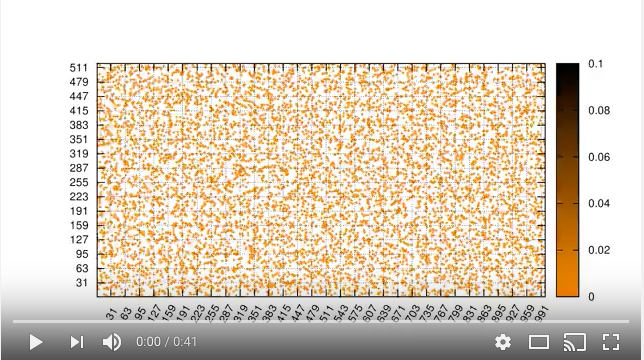
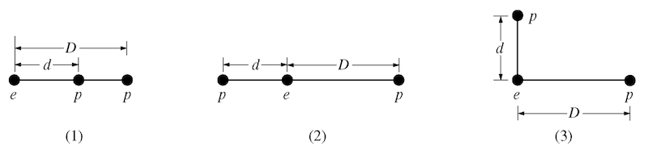

[**Link to Slack team**](http://msuphysics481fall2019.slack.com)

### Preface
Homework in this class is a very large part of the learning experience (and a large fraction of your grade!). The homework might look long, but that is because it is not really serving as a check on whether you are getting things from lecture. It is meant to help you learn the material, the importance of different aspects of the material, and the implications of the material on your future work. So there will typically be longer descriptions in the problem statements. The work you are being asked to do is no longer than a standard lecture course, but the kinds of questions might be different. We strongly encourage you to work together (and with the Bryan and Danny) on these homework problems, but you must turn in your own work.

### Submitting your homework

All of your pencil-and-paper solutions can be turned in at the beginning of class on Friday. Homework solutions that require Python are to be turned in online using Dropbox file requests. Each homework assignment will have a different file request link. Make sure that your name appears in the filename of the notebook (e.g., notebook_for_problem_4_dannycaballero.ipynb). For homeworks with multiple notebook submissions, you may either combine the notebooks or submit separate notebooks for each problem.

### What is Homework 1 about?

Homework 1 emphasizes the mathematical formalism and related thinking that you will draw on in this class. This homework focuses on Sections 1.1-1.4 of Griffiths, which covers differential, integral, and vector calculus. It also serves as an introduction to using [Jupyter notebooks](http://jupyter.org), which you will use on most homework assignments. With regard to computation on this homework, you will be using the [matplotlib](http://matplotlib.org/) library, which allows you to plot different kinds of figures. These first few computational exercises will serve as an introduction to (or a reminder of) the kinds of things we will do with Python this semester.

### Link for code submissions

[**Dropbox file request link for Homework 1**](https://www.dropbox.com/request/TWSUUsUgJ7zKmQeAuDzB)

### Homework questions

#### 1. Reminders of Integrals Past
In this course, you will perform lots of different kinds of integrals, some of which you might have done in previous courses. In this problem, we will just dust off some of those integration techniques. To earn full credit, you will need to explain key steps of the integration for each one, not simply do the mathematics.

1. *Line (or path) integrals* - These integrals are important for thinking about energy (and in our case electric potential).
  - Determine the work done by the vector force $\mathbf{F} = y^2\;\hat{x} - 2x^2\;\hat{y}$ along the path $y=x^2$ from (0,0) to (3,9). This path is restricted to the x-y plane and recall that $W=\int \mathbf{F}\cdot d\mathbf{l}$.
  - Is the result of this line integral path-independent (i.e., is $\mathbf{F}$ a [conservative vector field](https://en.wikipedia.org/wiki/Conservative_vector_field))? Explain why or why not.
2. *Surface integrals* - Calculating the flux over a particular surface is a very common way of determine the electric field.
  - Evaluate the integral $\int_S \mathbf{v}\cdot d\mathbf{A}$ where $\mathbf{v}(x,y,z) = 5x\;\hat{y} + 2y\;\hat{z}$ and $S$ is the rectangular surface lying in x-z plane from (0,0,0) to (1,0,5). Choose the direction of $+\hat{y}$ to be indicative of positive flux.
  - Explain how the resulting sign of the flux makes sense. You may use sketches or diagrams.
3. *Volume integrals* - It will be common for you to determine the amount of total charge in a situation where the charge is distributed in space according to some function. You might be familiar with this concept from the perspective of distributed mass in Classical Mechanics.
  - Consider two different spheres: one with uniform mass density, $\rho_0$, and the other with a radially varying density, $\rho(r)=\frac{3\rho_0}{4R^2}r^2$.
  - If both spheres have the same radius $R$, which has more mass?

#### 2. What operations can be done to different kinds of functions?
1. Given the scalar function $T(x,y,z)$ (e.g., the temperature at any point in the room), which of the three operations (div, grad, and/or curl) can be sensibly operated on $T$? For each which can:
  - give a formula for the result,
  - explain in words how you would interpret the result, and
  - identify if the result a vector or scalar.
2. Given the vector function $\vec{V}(x,y,z)$ (e.g., the velocity of a flowing fluid), which of the three operations (div, grad, and/or curl) can be sensibly operated on $\vec{V}$? For each which can:
  - give a formula for the result,
  - explain in words how you would interpret the result, and
  - identify if the result a vector or scalar.

#### 3. Determine the gradient of a scalar function
In Griffiths, $\vec{\mathfrak{r}}$ represents the separation vector between source charges $\langle x', y', z' \rangle$ and the field point -- location of test charge -- $\langle x, y, z \rangle$. The separation vector is a **critically important** vector in electrodynamics as it underlies all of the mathematical models that describe how source charges produce electric and magnetic fields. To that end, you will often do some mathematical manipulations of the separation vector. You are asked to perform two common manipulations below.

1. Calculate the gradient of the magnitude of the separation vector (i.e., $\nabla\|\vec{\mathfrak{r}}\|$).
2. Calculate the gradient of the inverse of the magnitude of the separation vector (i.e., $\nabla \dfrac{1}{\|\vec{\mathfrak{r}}\|}$).
3. Show the gradients of these functions can be written as functions of the separation vector ($\vec{\mathfrak{r}}$) and/or its magntiude ($\|\vec{\mathfrak{r}}\|$). (*Hint: it might be easier to do this by explicitly writing out the function in Cartesian coordinates.*)
4. What vector identities have you developed for the separation vector? This is just asking you to state them based on your answers from parts 1, 2, and 3.

#### 4. Analyzing divergence and curl visually
Calculating the divergence and curl of a vector field analytically is possible when the field is a well-known function (e.g., $\vec{V}(x,y,z)$). However, it will not always be the case that you know the function that generates the vector field. For example, in experimental fluid mechanics, measurements of the velocity field are done by tracking individual particles (called "tracers") that move in the field.

The displacement of those tracers is used to numerically reconstruct the velocity field of the fluid (by way of numerical derivatives), which usually does not conform to a known function. However, it is important to know if the flow has divergence or curl overall or at specific points as the models for fluid flow that are used to analyze the velocity field strongly depend on these results. Hence, visual inspection of a field (in our case, electromagnetic fields) is an important tool to understand which models might be used to analyze the field. This will be exceedingly important in our distinction between electric and magnetic fields as well as when the fields begin to vary with time.

For each of the four vector fields sketched below:

1. Which of them have a nonzero *divergence* somewhere? (If the divergence is nonzero *only* at isolated points, which point(s) would that be?)
2. Which of the following fields have nonzero *curl* somewhere? (If the curl is nonzero *only* at isolated points, which point(s) would that be?)
3. Provide a brief explanation for each of your answers above.

|||
|:-:|:-:|
| Field A | Field B |
|  |  |
| Field C | Field D |
|  |  |

#### 5. Plotting vector functions with `matplotlib`
Physics is both a mathematical and visual science. It is important to develop the ability to sketch and plot figures of various types. For the early part of this class, plotting the field generated by electric charges is important to understanding the field itself. In this problem, you will learn to use the [`matplotlib` library](http://matplotlib.org) to [plot vector fields](http://matplotlib.org/examples/pylab_examples/quiver_demo.html). As with the previous computational problem, you can [download this working Jupyter notebook](../jupyter/HW1-VectorFieldsProblem.ipynb) ([view it here](https://github.com/dannycab/phy481msu_f2019/blob/master/jupyter/HW1-VectorFieldsProblem.ipynb)), which describes how this kind of plotting is done for a specific case ($\vec{v}(x,y)=y\hat{x}$).

It will be up to you to plot additional figures for these cases:

1. $\vec{v}(x,y)=r\hat{r}$ (where $\vec{r}$ refers to the usual $\vec{r}$ in spherical coordinates.)
2. $\vec{v}(x,y)=\hat{r}/r$
3. $\vec{v}(x,y) = \dfrac{x}{(\sqrt{x^2+y^2})^3}\hat{x}+\dfrac{y}{(\sqrt{x^2+y^2})^3}\hat{y}$
4. $\vec{v}(x,y) = \hat{\phi}$ (where $\\phi$ is the usual plane-polar coordinate.)
5. For each case above, can you describe a physical situation where the field would be applicable?

**When we construct different kinds of fields in this class, you will use code like this to visualize the field and discuss it.**

You will turn in all parts of this problem via [Dropbox file request.](https://www.dropbox.com/request/TWSUUsUgJ7zKmQeAuDzB)

#### 6. Vector proofs can be incredibly useful
In electromagnetism, developing a deep understanding of vector mathematics can facilitate a deeper understanding of the physical systems that we will investigate. While we will rarely ask you to prove relationships outright, knowing how certain proofs are done can often help you simplify a complicated problem.

For example, in this problem, you will learn how we often use general vector operations with unspecified surfaces to make general statements about the field. In Griffiths, you read about a few integral theorems: the gradient theorem, Gauss's theorem (for divergences), and Stokes' theorem (for curls). You will make use of those theorems to prove a few things to develop some intuition about vector calculus.

1. From vector calculus, you know that the curl of any gradient of any scalar field is zero: $\nabla \times \nabla T(x,y,z) = 0 $.
  - Use the corollary of the gradient theorem, namely that closed loop integral of any gradient of a scalar field is zero, $\oint \nabla T\cdot d\mathbf{l} = 0$, along with Stokes' theorem, $\int_S(\nabla \times \mathbf{v})\cdot d\mathbf{a} = \oint_C \mathbf{v}\cdot d\mathbf{l}$, to demonstrate that the curl of a gradient is zero.
  - What is the essential argument that needs to be made that proves that the result is generalizable to any situation? (*Hint: The surface (S) and thus the line (C) that bounds the surface are not specified.*)
  - What does your result from the previous question tell you about possibility of swirly-ness of the gradient of a temperature field, $\nabla T$, over any specified surface?
2. From vector calculus, you know that the divergence of the curl of any vector field is zero, $\nabla \cdot (\nabla \times \mathbf{v}) = 0$.
  - Use the corollary of Stokes' theorem, namely that the closed surface integral of the curl of a vector field is zero, $\oint_S (\nabla \times \mathbf{v})\cdot d\mathbf{a} = 0 $, along with the divergence theorem, $\int(\nabla \cdot \mathbf{v}) d\tau = \oint_S \mathbf{v}\cdot d\mathbf{a}$, to demonstrate that the divergence of a curl is zero.
  - What is the essential argument that needs to be made the proves the result is generalizable to any situation? (*Hint: The volume (V) and thus the surface (S) that bounds it are not specified.*)
3. By doing these two proofs, what do you feel like you learned about vector calculus that you didn't already know?

#### 7. Applying vector calculus knowledge

Griffiths and other E&M writers like to use elegant conceptualizations that quickly get you to a result with seemingly very little work. This relies on a deeper understanding of vector calculus, which you will develop in this course. In this problem, you will explain a conceptualization that helps you come to a result, then you will connect that conceptualization to a mathematical proof. For this, consider the surface integral that we define as the ''vector area'',

$\mathbf{a} = \iint_S d\mathbf{a}$.

1. For a hemispherical bowl (a half sphere) of radius $R$, you will find $\mathbf{a}$. Sketch the situation and show the vector $d\mathbf{a}$ in your sketch. In which direction will $\mathbf{a}$ point once the integral is complete? How do you know?
2. What is a reasonable guess for the value of $\vert\mathbf{a}\vert$? Why is that a reasonable guess?
3. Compute directly the value of $\mathbf{a}$ and comment on your guesses from parts 1 and 2. It's ok if your answers to parts 1 and 2 don't match the computed answer. Explain how things fit together (e.g., What did you get right? What needs more work on your conceptualization?).
4. The value of $\mathbf{a}$ takes on the same value for _any_ closed surface. What is a reasonable guess for $\mathbf{a}$ in this case? What is your rationale that makes that guess reasonable?
5. Show using the gradient theorem what the value of $\mathbf{a}$ is for any closed surface. Compare your result to your answer to part 4. Again, it's ok if your answer to part 4 don't match the computed answer. Explain how things fit together (e.g., What did you get right? What needs more work on your conceptualization?).

#### 8. GRE Prep: Electric Forces

The Physics GRE (PGRE) is a test that some of you might take if you are considering graduate school in physics. There has been a lot of discussion about the PGRE lately as [it has been shown to be a biased test](https://advances.sciencemag.org/content/5/1/eaat7550). Some schools and programs are [doing away with it](https://aas.org/posts/news/2015/12/presidents-column-rethinking-role-gre) as an admission requirement, including [our own astronomy program](https://astro.natsci.msu.edu/graduate/how-to-apply/). However, it is still required by many schools.

While I (personally) disagree with the use of the PGRE in graduate admissions for physics and astronomy, I do think it is important for you to prepare for it (at this moment in time) if you are considering graduate school. I will try to include one homework problem per week that is a relevant PGRE problem. Below you will find the problem as written and an extra part asking you to explain your answer (which does not appear on the PGRE).

1. The figure above shows three arrangements of one electron ($e$) and two protons ($p$). Which of the following is true about the magnitude $F$ of the net electrostatic force acting on the electron due to the protons?
  - $F_1 > F_2 > F_3$
  - $F_1 = F_2 > F_3$
  - $F_1 > F_3 > F_2$
  - $F_2 > F_1 > F_3$
  - $F_2 > F_3 > F_1$
2. Explain how you arrived at your answer. What physical principle(s) is this question testing your understanding of?
