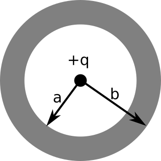

Homework 10 focuses on developing ideas about the D-field including how to apply Gauss' Law for $\mathbf{D}$ and the relationships between $\mathbf{D}$, $\mathbf{E}$, and $\mathbf{P}$.

### 1. Bound charges and the D-field

Consider a long teflon rod, (a dielectric cylinder), radius $a$. Imagine that we could somehow set up a permanent polarization $\mathbf{P}(s,\phi,z) = k\mathbf{s} ( = ks\hat{s})$, where $s$ is the usual cylindrical radial vector from the $z$-axis, and $k$ is a constant). Neglect end effects, the cylinder is long.

1. Calculate the bound charges $\sigma_{bound}$ (on the outer surface) and $\rho_{bound}$ (in the interior of the rod). What are the units of your constant $k$? Show that the units work out in all formulas you have used involving $k$.
2. Next, use these bound charges (along with Gauss' law, this problem has very high symmetry!) to find the electric field, $\mathbf{E}$ inside and outside the cylinder. (Your answer should include both the direction and magnitude.)
3. Finally, determine the electric displacement field ($\mathbf{D}$) inside and outside the cylinder using the fundamental definition ($\mathbf{D} = \varepsilon_0 \mathbf{E} + \mathbf{P}$) and verify that "Gauss’ law for D-fields" works out. Explain briefly in words why your answers are what they are.

### 2. Bound charges and the D-field II

Now let's hollow out that teflon rod, so it has inner radius $b$, and outer radius is (still) $a$. Just to make things a little different here, suppose we now set up a different polarization within the teflon material, namely $\mathbf{P}(s,\phi,z) = k\hat{s}$ for $b<s<a$ and where $k$ is a given constant.

1. We have vacuum for $s<b$ and $s>a$. What does that tell you about $\mathbf{P}$ in those regions? Find the bound charges $\sigma_{bound}$ (on inner and outer surfaces of the hollow rod) and $\rho_{bound}$ (everywhere else).
2. Use these bound charges, along with Gauss' law, to find the electric field, $\mathbf{E}$, everywhere in space. (Your answer should include the direction and magnitude.)
3. Use Gauss' Law for D-fields to find $\mathbf{D}$ everywhere in space. *This should be quick – use symmetry! Are there any free charges in this problem?* Use this (simple) result for $\mathbf{D}$ along with $\mathbf{D}=\varepsilon_0 \mathbf{E}+\mathbf{P}$ to find $\mathbf{E}$ everywhere in space. (This should serve as a check for part 1, and shows why sometimes thinking about D-fields is easier and faster!)

### 3. Point charge in a spherical plastic shell

A point charge $+Q$ is at the center of a spherical plastic shell (inner radius $a$, outer radius $b$)  The shell is a **linear** dielectric, with a dielectric constant $\varepsilon_r$. The shell is electrically neutral (it has no free charges).

1.  Compute $\mathbf{E}$, $\mathbf{D}$, and $\mathbf{P}$ everywhere.
2. How is $\mathbf{E}$ inside the plastic ($a<r<b$) different from what it would have been if the plastic were not present? (Explain why/how this difference arises physically.)
3. Sketch $\mathbf{E}(r)$, briefly commenting on any interesting features.
4. Similarly, sketch $\mathbf{D}(r)$.

### 4. Injecting free charges

A solid sphere (radius $R$) of linear dielectric material (dielectric constant $\varepsilon_r$) has been "injected" with a uniform free charge density $\rho_f$ throughout its volume.

1. Find the potential at the center of the sphere (with $V(\infty)=0$). *Hint: You might want to find D first.*
2. Does your answer come out larger or smaller than for a simple sphere of charge with uniform charge density $\rho_f$ (that is, if you had neglected the effect of the dielectric constant)? Would that mean setting $\varepsilon_r$ to 0, or to 1?  Does this result make physical sense to you? Explain briefly.
3. What do you get in the limit of infinite dielectric constant? What physical situation does that limit remind you of?
