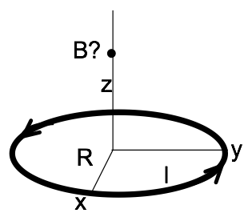
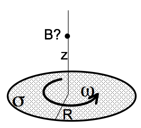
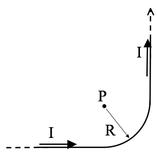
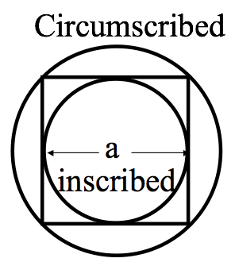
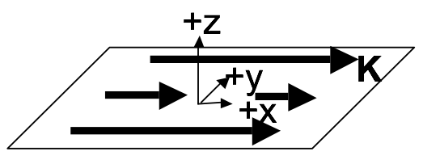
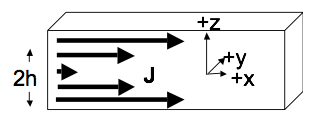
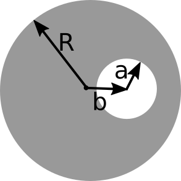

Homework 12 focuses on computing the magnetic field using Biot-Savart and Ampere's Law, which are the two direct methods for computing the magnetic field. It begins to introduce the vector potential, which is an alternative method for determining the magnetic field. It is quite a bit longer than the usual homework because it covers two weeks of class (i.e., it is not due until after Thanksgiving). However, there's no computational problem on this homework set.

## 1. Magnetic field of distributed currents

1. Compute the magnetic field $\mathbf{B}(0,0,z)$ along the $z$-axis for a current loop (current $I$, radius $R$, sitting in $x-y$ plane, centered around the $z$-axis). It is shown in the figure above.
2. Last week we had a DVD (radius $R$) with a fixed, constant, uniform surface electric charge density $\sigma$ everywhere on its top surface (figure below). It was spinning at angular velocity $\omega$ about its center (the origin).  You found the current density $\mathbf{K}$ at a distance $r$ from the center. Use that result to find the magnetic field $\mathbf{B}(0,0,z)$ at any distance $z$ directly above the origin.  (Part 1 above might help.)
3. Does your answer to part 2 seem reasonable? Please check it, with units, and some limiting behaviors (e.g. what do you expect if $R \rightarrow 0$? $\omega \rightarrow 0$?  $z\rightarrow \infty$? For this last one, don't just say "it goes to zero. This is a dipole, so $B$ should go to 0 like $1/z^3$. (Right?) Show that it does!

## 2. Magnetic field of a bent wire

An infinitely long wire has been bent into a right angle turn, as shown.  The "curvy part" where it bends is a perfect quarter circle, radius $R$.  Point P is exactly at the center of that quarter circle. A steady current $I$ flows through this wire.

1. Find $\mathbf{B}$ at point P (magnitude and direction) (*No need to derive any formulas “from scratch” if you can get them from Griffiths’ examples!*)

## 3. Estimating the magnetic field of a square loop

1. Find $\mathbf{B}$ at the exact center of a square current loop (current $I$ running around a wire bent in the shape of a square of side $a$) (*No need to derive any formulas “from scratch” if you can get them from Griffiths’ examples!*)
2. If we had such a loop in the lab and wanted $\mathbf{B}$ at the center, we might do the above calculation, but if we were planning an experiment and just wanted a rough estimate of the magnetic field, we might "assume a spherical cow": assume the square was really a circle. We've done that problem ($\mathbf{B}$ at the center of a circular loop). It's much simpler than the square! You don't have to rederive it, but think back to how we got that result, and why it turned out to be a relatively easy application of Biot-Savart. But what radius circle would you use, to estimate $\mathbf{B}$?  You might consider finding $\mathbf{B}$ for the "inscribed" and "circumscribed" circles and then average. How good an approximation does that turn out to be? (Can you think of a better way?)

## 4. Ampere's Law - themes and variations
Consider a thin sheet with uniform surface current density.

1. Use the Biot-Savart law to find $\mathbf{B}(x,y,z)$ both above and below the sheet, by integration.
Note: The integral is slightly nasty. Before you turn to WolframAlpha - simplify as much as possible! Set up the integral, be explicit about what curly $R$ is, what $da'$ is, etc, what your integration limits are, etc. Then, make clear mathematical and/or physical arguments based on symmetry to convince yourself of the direction of the B field (both above and below the sheet), and to argue how $\mathbf{B}(x,y,z)$ depends (or doesn't) on $x$ and $y$. (If you know it doesn't depend on x or y, you could e.g. choose x=y=0 to simplify... But first you must convince us that's legit!)
2. Now solve the above problem using Ampere's law. (Much easier than part 1, isn't it?) Please be explicit about what Amperian loop(s) you are drawing and why. What assumptions (or results from part 1) are you making/using? (*Griffiths solves this problem, so don't just copy him, work it out for yourself!*)
3. Now let's add a second parallel sheet at $z=+a$ with a current running the other way. (Formally, this means $\mathbf{J}=-K_0\delta(z-a)\hat{x}$. Do you understand this notation?) Use the superposition principle (do NOT start from scratch or use Ampere's law again, this part should be relatively quick) to find B between the two sheets, and also *outside* (above or below) both sheets. *Does this remind you of a familiar electrostatics problem at all? How?*
4. Griffiths derives a formula for the B field from a solenoid (Example 5.9) Rewrite his answer (which is in terms of I) so it is expressed in terms of K (See his Fig 5.34 and 5.35 for help with this). Briefly compare with part 3, do you see any rough connections?

## 5. Ampere's Law

Consider a thick SLAB of current.

The slab is infinite in (both) $x$ and $y$, but finite in $z$. So we must think about the volume current density $\mathbf{J}$, rather than $\mathbf{K}$. The slab has thickness $2h$ (It runs from $z=-h$ to $z=+h$) Let's assume that the current is still flowing in the $+x$ direction, and is uniform in the $x$ and $y$ dimensions, but now $\mathbf{J}$ depends on height linearly, i.e. $\mathbf{J} = J_0\,\mathrm{abs}(z)\,\hat{x}$, inside the slab (but is 0 above or below the slab), where $\mathrm{abs}(z)$ is the absolute value of $z$.

1. Find the B field (magnitude and direction) everywhere in space (above, below, and also, most interestingly, inside the slab!)

## 6. Quick Ampere's Law

Suppose $\mathbf{B}$ in a region of space centered on the origin has cylindrical symmetry and is given by $\mathbf{B} = B_0\hat{\phi}$ where $B_0$ is a constant, and $\hat{\phi}$ is the azimuthal direction in cylindrical coordinates.

1. What is the current density in this region of space?
2. Suppose the current density that you found extends out to a radius $R$ and is zero for $r > R$.  What is the magnetic field for $r > R$?

## 7. Ampere and superposition
A clever use of superposition should can make seemingly complicated situations easier to solve.

1. A long (infinite) wire (cylindrical conductor of radius $R$, whose axis coincides with the $z$ axis) carries a uniformly distributed current $I_0$ in the $+z$ direction. A cylindrical hole is drilled out of the conductor, parallel to the $z$ axis, (see figure above for geometry). The center of the hole is at $x = b$, and the radius is $a$.  Determine the magnetic field *in the hole region.*
2. If this is an ordinary wire carrying ordinary household currents, and the drilled hole has dimensions roughly shown to scale in the figure above, make an order of magnitude estimate for the strength of the $B$ field in that region. How does it compare to the earth's field?   *You should find that the B field in the hole is uniform - that was just a little surprising to me!*

## 8. Formal manipulations and vector calculus

Griffiths (section 5.3.2) shows that, given Biot-Savart, we can arrive at Ampere's law.

1. Go through that derivation and try to recreate it/make sense of it. **Don't just copy it down - do all the steps yourself.** There are a few "gaps" in his derivation that you should be explicit about - e.g., Eq 5.50 (.52 in the 4th ed) is missing terms, what happened to them? Are you convinced of the minus sign shenanigans leading to 5.52 (.54 in 4th ed)? Convince us you understand them! Do you understand the ending: why did the contribution in Eq. 5.53 (.55 in 4th ed) "go away"?

2. Use similar mathematical gymnastics to start from the Biot-Savart law and end with $\mathbf{B} = \nabla \times \mathbf{A}$, where
$\mathbf{A}(\mathbf{r}) = \dfrac{\mu_0}{4 \pi} \int \dfrac{\mathbf{J}(\mathbf{r}')}{\mathfrak{R}}d\tau'$. (this is Griffiths Eq 5.63, or .65 in 4th edition). You’ll do this in a different way than Griffiths does (though I suggest you convince yourself you can see it his way too, which is section 5.4.1!). (Note: Part 2 is easier than part 1, really!!)
- Start with the Biot-Savart law (Eq 5.45 , or 5.47 in the 4th ed).
- Make use  of the handy identity we've seen several times this term: $\nabla \dfrac{1}{\mathfrak{R}} = -\dfrac{1}{\mathfrak{R}^2}\hat{\mathfrak{R}}$  (Do you know where this relation comes from, can you show it?)
- Then use Griffiths' product rule #7 (front flyleaf) to manipulate your expression until you get to $\mathbf{B} = \nabla \times$ something. That “something” should be precisely the formula we’re after!
*At some point you will need to pull the curl past an integral sign - be sure to justify why this is a perfectly legitimate thing to do.*
