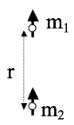
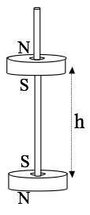

Homework 13 finishes our discussion of magnetism by focusing on the vector potential, which is a useful tool for calcualting the magnetic field in some problems, and magnetic dipoles.

[Dropbox file request for Homework 13](https://www.dropbox.com/request/mf0THidGcoxyWqWXHZhH)

## 1. Vector Potential I
1. A long (infinite) wire (cylindrical conductor, radius $R$, whose axis coincides with the $z$ axis) carries a uniformly distributed current $I_0$ in the $+z$ direction. Assuming $\nabla \cdot \mathbf{A} = 0$ (the "Coulomb gauge"), and choosing $\mathbf{A}=0$ at the edge of the wire, show that the vector potential inside the wire could be given by $A= c I_0(1-s^2/R^2)$.  Find the constant $c$ (including units.) Things to explicitly find/discuss: What is the vector direction of $\mathbf{A}$? (Does it "make sense" in any way to you?)  Is your answer unique, or is there any remaining "ambiguity" in $\mathbf{A}$? (Note that we're not asking you to derive $\mathbf{A}$ from scratch, just to see that this choice of A "works")
2. What is the vector potential outside that wire? (Make sure that it still satisfies $\nabla \cdot \mathbf{A} = 0$, and make sure that $\mathbf{A}$ is continuous at the edge of the wire, consistent with part 1).  Here again, is your answer unique, or is there any remaining "ambiguity" in $\mathbf{A}(outside)$?

## 2. Vector Potential II
Griffiths Fig 5.48 is a handy "triangle" summarizing the mathematical connections between $\mathbf{J}$, $\mathbf{A}$, and $\mathbf{B}$ (like Fig. 2.35) But there's a missing link, he has nothing for the left arrow from $\mathbf{B}$ to $\mathbf{A}$. Note the equations defining $\mathbf{A}$ are very analogous to the basic Maxwell's equations for $\mathbf{B}$:

$$\nabla \cdot \mathbf{B} = 0 \leftrightarrow \nabla \cdot \mathbf{A} = 0$$

$$\nabla \times \mathbf{B} = \mu_0\mathbf{J} \leftrightarrow \nabla \times \mathbf{A} = \mathbf{B}$$

1. So $\mathbf{A}$ depends on $\mathbf{B}$ in the same way (mathematically) the $\mathbf{B}$ depends on $\mathbf{J}$. (Think, Biot-Savart!) Use this idea to just write down a formula for $\mathbf{A}$ in terms of $\mathbf{B}$ to finish off that triangle.

2. In lecture notes (and/or Griffiths Ex. 5.9) we found the $\mathbf{B}$ field everywhere inside (and outside) an infinite solenoid (which you can think of as a cylinder with uniform surface current flowing azimuthally around it (see figure below). See Griff. Fig 5.35. Use the basic idea from the previous part of this question to, therefore, quickly and easily just write down the vector potential $\mathbf{A}$ in a situation where $\mathbf{B}$ looks analogous to that, i.e. $\mathbf{B} = C\delta(s-R)\hat{\phi}$, with $C$ constant. Also, sketch this $\mathbf{A}$ for us, please.  (You should be able to just "see" the answer, no nasty integral needed!)
3. For you to discuss: What physical situation creates such a $\mathbf{B}$ field? (This is tricky - think about it!) Also, if I gave you some $\mathbf{B}$ field and asked for $\mathbf{A}$, can you now think of an "analogue method", i.e. an experiment where you could let nature do this for you, instead of computing it?
*It's cool - think about what's going on here. You have a previously solved problem, where a given $\mathbf{J}$ led us to some $\mathbf{B}$. Now we immediately know what the vector potential is in a very different physical situation, one where $\mathbf{B}$ happens to look like $\mathbf{J}$ did in that previous problem.*

## 3. Coordinate Free Dipole Equation

In class we derived the magnetic field formula for the magnetic moment of a pure dipole which points in the z direction, located at the origin:

$$\mathbf{B} = \dfrac{\mu_0 m}{4 \pi r^3}(2 \cos \theta\,\hat{r} + \sin \theta\,\hat{\theta})$$

Here $\mathbf{m}=I\mathbf{a}$ ($\mathbf{a}$ is the area vector of our tiny dipole) But sometimes $\mathbf{m}$ points in another direction than just $z$-hat! A more elegant way to write B which does not explicitly depend on any choice of coordinate axes is:

$$\mathbf{B} = \dfrac{\mu_0}{4 \pi r^3}(3 (\mathbf{m}\cdot\hat{r})\hat{r} - \mathbf{m})$$

1. For this problem, assume the second equation above is correct, define your $z$-axis to lie along the direction of the magnetic moment $\mathbf{m}$, and show that this leads back to first equation.

*Coordinate free formulas are nice, because now you can find B for more general situations!*

## 4. The magnetic bottle (EXTRA CREDIT)

On homework 11, you developed a visualization for the magnetic dipole. Here's a jupyter notebook that produces that visualization in two-dimesions ([download it](../jupyter/HW13-MotionInAMagneticBottle.ipynb) or [view it here](https://github.com/dannycab/phy481msu_f2018/blob/master/jupyter/HW13-MotionInAMagneticBottle.ipynb)). In this problem, you will add a second dipole of the same strength that points in the same direction as the previous one and investigate the motion of a charged particle in that magnetic field.

1. Place one magnetic dipole at $z = 10.0$, and the other at $z=−10.0$. Let both dipole moments point in the positive $z$-direction, with equal magnitude $10^4$. Make a vector plot of the resulting magnetic field, and describe your plot.
2. Make a hypothesis about what the charged particle's trajectory will be shaped like. Based on your vector plot and your physics knowledge, do you predict that the particle will be successfully confined? Why or why not?
3. Add to program to simulate the motion of an $\alpha$-particle in this magnetic field. Start the $\alpha$-particle at position $\langle −5.0,0.0,0.0 \rangle$, with initial velocity $100.0m/s$ in the $z$-direction. Plot the $\alpha$-particle's trajectory, and compare with your hypothesis. Also, compare and contrast this result with the $\alpha$-particle's trajectory in the uniform magnetic field in [Homework 11 - Problem 3](./homework11.html). **If you need help modeling this motion, the solution to homework 11 problem 3 is posted on SLACK. You may use what you need from this code.**
4. For further insight into the charged particle's trajectory, make a plot of the particle's $z$-coordinate vs. time. What does this plot tell you about the particle's motion? Is the particle successfully confined, or do you think it will eventually escape?

## 5. Semi-classical electron dipole moment

A thin uniform solid torus (a "donut") has total charge $Q$, mass $M$, radius $R$. It rotates around its own central axis at angular frequency $\omega$, as shown.

1. Find the magnetic dipole moment $m$ of this rotating donut. What are the SI units of dipole moment?
2. Compute the ratio $m/L$, the "magnetic dipole moment" divided by the angular momentum. This is called the "gyromagnetic ratio".
3. What is the gyromagnetic ratio for a uniform spinning sphere? *HINT: This question really doesn't require any additional calculating: picture the sphere as a bunch of rings, and apply the result of part 2.*
4. In quantum mechanics, the angular momentum of a spinning electron is $\hbar/2$. Use your results above to deduce the electron's magnetic dipole moment (in SI units.)

*Note: This "semi-classical" calculation is low by a factor of almost exactly 2. Dirac developed a relativistic form of quantum mechanics which got the factor of 2 right in the 1930's. In the '40's,  Feynman, Schwinger, and Tomonaga calculated tiny extra corrections arising from QED (Quantum electrodynamics) For fun, find the current best-value for the electron magnetic dipole moment. If you compare theory and measurement, you will be extremely impressed at the agreement (~12 digits!)  It may make you "believe" in quantum physics in a way you might not have before! That's not how it works in practice though- people use this measurement to extract a fundamental constant of nature, and then use that value to predict OTHER experiments.*

## 6. Force between magnets

Toy magnets seem to have a force law which "turns on" quite suddenly as they approach, it doesn't really feel like a $1/r^2$ force. That's because it is not!

1. Consider two small magnets (treat them as point-like perfect dipoles with magnetic moments $m_1$ and $m_2$, to keep life as simple as possible). In the configuration shown above ("opposite poles facing"), find the force between them as a function of distance r.  (Does the sign work out for you sensibly?)
2. Let's do a crude estimate of the strength of the magnetic moment of a simple cheap magnet.  Assume the atomic dipole moment of an iron atom is due to an (unpaired) electron spin. Question 2 above taught us what the magnetic dipole moment of a single electron is (or, just look it up to get the factor of 2 right!) The mass density and atomic mass of iron are also easy to look up. Consider a small, ordinary, kitchen fridge "button sized" magnet, and make a very rough estimate of its total magnetic moment.
3. Use your formula from part 1 to estimate how high ($h$) one such magnet would "float" above another (if oriented as shown below).
4. Does your answer seem at all realistic, based on your experiences with small magnets? (note that such a configuration is not stable - why not? I've seen toys like this, but they have a thin wooden peg to keep the magnets vertically aligned, that's how I drew it in the figure).

