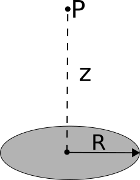

[Link to Slack team](http://phy481msuf2018.slack.com)

Homework 2 emphasizes the electric field and the principle of superposition that will form the basis of much of your understanding of electrostatics. This homework makes use of what you learned from Secs. 1.1-1.4 in Griffiths and adds to it the concepts from Sec. 2.1, which make up the bulk of the assignment. In addition, we have begun to introduce the idea of finding approximate formulae using Taylor expansions, which is one of the most common practices of theoretical physics. In this assignment, you will use a Jupyter notebook to determine the electric field of a point charge and a dipole as we build up the architecture to solve elecrtic field problems numerically.

[**Dropbox file request link for Homework 2**](https://www.dropbox.com/request/zMp5pS6dGRzcwg4MCHMn)

#### 1. Finding the angle between two suspended charges

When working through some physics, you will typically find yourself in a situation where a strict analytical solution to your problem evades you because the models that you have used have sophisticated algebraic forms that lead to transcendental equations, non-integrable forms, or other problematic situations. In these situations, it is often instructive to step back a moment and consider under what conditions you want to solve your problem. Those conditions might provide you with reasonable limitations and assumptions that lead to approximate forms that get you very close to what you need. In this problem, which has a familiar context from 184, we will give you the assumption to make. But in future problems, you might have to decide for yourself: *What assumptions and approximations can I make here and why?*

Two charges of identical mass $m$, one with charge $q$ and the other with charge $4q$, hang from strings of length $l$ from a common point. Assume that $q$ is sufficiently small that the electric force on each mass is quite small compared to the gravitational force on each.

1. Find an approximate expression for the angle $\theta$ that each charge makes with respect to the vertical.
2. Describe how this assumption of the relationship between the forces (i.e., that the electric force is small compared to the gravitational force) played out in your calculation, which quantities were approximated and why?
3. Check (show us!) that the units of your solution work out.
4. Show that the limiting behavior for large masses ($m$), large length ($l$), and small charge ($q$) are physically reasonable.

#### 2. A curious distribution of charge

Up till now, most of your experience with integration has likely been integrating functions that have anti-derivatives. While this is kind of integration is problematic when you have data that must be integrated (e.g., using measures of position to determine potential energy), we will focus on functions for which there are no anti-derivatives.

Consider a line of charge that lives on the x-axis. It exists from $x=0$ to $x=3$, and distribution of that charge is given by the Gaussian,

$$\lambda(x) = 2e^{-x^2}.$$

In this problem, you will work through this Jupyter notebook to determine the total charge one this line by performing the integral,

$$Q = \int_{0}^3 2e^{-x^2} dx.$$

You can [download the notebook](../jupyter/HW2-AnOddChargeDistribution.ipynb) (or [view it here](https://github.com/dannycab/phy481msu_f2019/blob/master/jupyter/HW2-AnOddChargeDistribution.ipynb)). As you work through this problem, you will work through the following activities:

1. Plot the distribution of charge. Does it look familiar to you in some way? Maybe you've seen it in other classes?
2. Use ``sympy`` to compute the integral of the function. What does it return? Discuss the function. Is it analytic?
3. Apply the trapezoidal rule to compute the integral of this function. Use 10 equal width steps. To receive full credit, you must write the code to do this and not use built-in integration functions of ``scipy``.
4. Apply Simpson's rule to compute the integral of this function. Again, use 10 equal with steps. Compare the result to part 3. To receive full credit, you must write the code to do this and not use built-in integration functions of ``scipy``.
5. Compute both integrals with increasingly more steps (i.e., from 10 to 100) and plot the results. That is compare the plots of what your integration schemes produce on a figure where the number of steps in on the horizontal axes and the value of the integral is on the vertical.
6. Look up ``scipy.integrate`` built-in quadrature function, ``quad.`` Use it to compute the same integral and compare its result to what your code produced. What are the two variables that ``quad`` gives you by default?
7. Explain how the trapezoidal rule and Simpson's rule are different. How do the compute the integrals? Explain how the [Gaussian quadrature](https://en.wikipedia.org/wiki/Gaussian_quadrature), which is what ``quad`` and its cousins in the ``scipy.integrate`` library do, is different from both of them.

In working through the first 3 questions, some scaffolded code has been provided for an analytically integrable function. It can be re-used.

*Hint: for the summations that require you to distinguish between even and odd terms, review the ``range`` function, which allows you to specify how many steps to take in between each term in a sum.*

#### 5. Disk of charge - Checking new results against your intuition

In this class, you will often produce new formulae that describe some situation for which you might not have developed intuition yet. So, one question you should always be asking yourself is: *How do I believe the physics/math that I've just done?!* In this problem, you will develop some techniques for checking your results against the intuition that you already hold.

Consider a thin disk of radius $R$ with a uniform charge density, $-\sigma$.

1. Find the electric field at point P, which is a distance $z$ above the center of the disk, by integrating across the surface of the disk. *Yes, we know that this field is well-known, but the practice of setting up and doing these kinds of integrals is important.* The functional form of your solution is a bit complicated and it might be tough to see how if its correct - *you can certainly look up the answer to check it, but you won't always be able to do that in this class (and in life)!*
2. If you were very far from this disk, what would you expect the field to look like? Use your intuition from PHY 184. Explicitly check the limiting form of your solution at very large $z$ (i.e., when $z >> R$). *By "limiting form", we mean "how it behaves as a function of distance".* So, don't just say "it goes to zero" (if that's what you think happens). Tell us how, functionally it vanishes (like $1/z$? like $e^{-z}$? Something else?).
3. If you were very close to the disk, what would expect the field too look like? Again, use your intuition from PHY 184. Explicitly check the limiting form of your solution at very small $z$ (i.e., when $z << R$).
4. Sketch a qualitatively correct graph of the component of the electric field in the $z$-direction along the center line. Be sure to include both the positive and negative $z$-axis in your graph. Your answers to parts 2 and 3 might help you here.

#### 6. Checking your answers

**A situation**: You've just spent an hour calculating the magnitude of the electric field of a charged ring of radius $R$ that holds a uniform linear charge density $\lambda$ at a distance $z$ from the center of the ring. You ended up with the result:

$E = \dfrac{1}{4\pi\varepsilon_0}\dfrac{\lambda 2\pi Rz}{(z^2+R^2)^{3/2}}$

1. Check the units of this expression to verify it is correct.
2. What are at least two other indepdent checks that you could do to see if you believe your result?
3. Perform those two independent checks. Comment on if you believe this result based on these checks. Why or why not?
