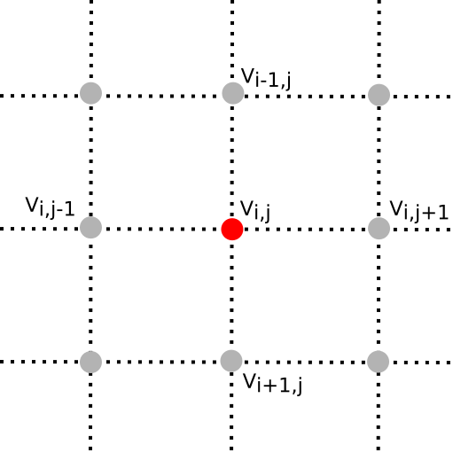
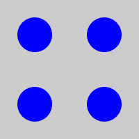
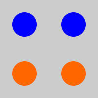
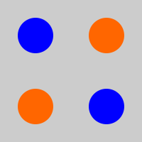
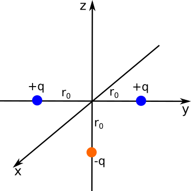

Homework 8 finishes up our discussion of the relaxation methods with a 2D problem. The bonus part of it illustrates the simplicity of problems that cannot be solved analytically. The rest of the homework focuses on another technique for solving for the electriuc potential -- using separation of variables in spherical coordinates -- and introduces the concept of the multipole expansions, which is still another way to find the potential in the "far field".

[Dropbox file request for Homework 8](https://www.dropbox.com/request/NHhQGljURktMrB5WJGt4)

## 1. Method of Relaxation for Cartesian Problems

One of the major properties of a solution to Laplace's equation is that the value of the potential at a point is equal the average of all the points surrounding it (i.e., a sphere in 3D or a circle in 2D). We can exploit this property to solve Laplace's equation numerically by successively computing the average value of the potential at a point on a mesh (a grid of 2D points in this case) based on the 4 other points that surround it (see the figure below).

To be explicit, in the simplest relaxation codes, which can run for an inordinate amount of time given the size of the mesh and the error tolerance demanded, we replace the value of the potential $V_{i,j}$ with the arithmetic average of its closest neighbors on the mesh:

$$V_{i,j} = \dfrac{1}{4}\left(V_{i-1,j} + V_{i,j-1} + V_{i,j+1} + V_{i+1,j}  \right)$$

The procedure for solving Laplace's equation numerically involves the following steps:

* **Step 1:** Slice up the space where $\nabla^2 V = 0$ (and the boundary) into a grid of points (called a "mesh") that are spaced an equal distance apart. *That mesh may have different spacing between points based on what the details of the problem being solved might be. For example, if the potential is expected to be change over short distances in some points and not others, it can make sense to change the spacing to optimize computational time (or memory).* In this problem, we will use a mesh of equally spaced points.
* **Step 2:** Set the value of the boundary points given the specific problem you intend to solve. *This will typically be done in the initial parts of the program and can be changed easily to solve other kinds of problems.* In this problem, we will start with a non-zero constant value (10 V) on one edge and zero at the other 3 edges.
* **Step 3:** Starting at some location away from the boundary, systematically loop through each point applying the averaging function given above. *It would be typical to start at one corner of the mesh and move systematically across (or down) and then down (or across) calculating the value at each new point as you go.*
* **Step 4:** Compute the difference between the starting values of the potential and the values after a full iteration. Compare this difference to the accepted error that you decided on before starting the calculation, $Error_{i,j} = Vnew_{i,j}-Vold_{i,j}$. *Here, you could use the average error, the maximum error, or something else.* In this problem, you will can choose what error to use.
* **Step 5:** Repeat steps 3 and 4 until the computed error is below the accepted error. *Note that you should build in a maximum number of steps to take in case the code doesn't coverge on an answer quickly.*
* **Step 6:** Plot the results as either a 3D plot or a contour map (or both). In this problem, you are asked to produce both plots.

1. Using the code you wrote for [Problem 6 on the last homework](./homework7.html), expand it to solve the 2D problem where one boundary is set at 10V and the others are set to zero. You will have to pick a reasonable step size for the mesh (make sure it can be adjusted!). If you did not complete this problem, you can download this notebook from Slack.
2. Produce a 3D Plot of the potential.
3. [Review how to make a contour plot using matplotlib](http://matplotlib.org/examples/pylab_examples/contour_demo.html) and produce a contour plot of your results.
4. Determine how many iterations on the mesh (*look for the print statements at the end of the code*) are needed to obtain an error tolerances of: 1e-2, 1e-3, 1e-4, 1e-5, 1e-6, and 1e-7. *You might have to adjust the maximum number of iterations as the error tolerance is decreased.*
5. Set the value of one of the boundaries to be a stepwise value (e.g., half the points to be 10V and the other half to -10V) with the other 3 boundaries to 0V. Repeat parts 2 and 3. Make note of the shape of the potenital plot. Are there any local max or min? Do they go away with tighter error tolerance?
6. **BONUS** Put a hole in the mesh. Set the exterior boundary to anything you like, but select several points in the interior of the mesh to bound the problem as well. That is fix the potential on several interiro points. This is like having a 2D cavity with an interior boundary. This problem cannot be solved analytically, but is very easy to conceive.

## 2. Sphere with a known potential

We have a sphere (radius, $R$) where we have glued charges to the outside such that the electric potential at the surface of the sphere is given by:

$$V_0 = k \cos 3\theta$$

where $k$ is some constant.

You are going to find the potential inside and outside the sphere (there are no charges other than those at the surface of the sphere) as well as the charge density $\sigma(\theta)$ on the surface of the sphere. Each part of this problem is meant to walk you through the process for solving these kinds of boundary-value problems.

1. Rewrite the potential at the surface using Legendre polynomials. *You will need to dust off some trig identities to do this.* You can find a [listing of Legendre polynomials online](http://mathworld.wolfram.com/LegendrePolynomial.html).
2. Using this boundary condition and the knowledge that $V$ should be finite inside the sphere, find the electric potential, $V(r,\theta)$, inside this sphere. You do not have to re-derive the general solution to Laplace's equation, just use the result:
$$V(r,\theta) = \sum_l \left(A_lr^l+\dfrac{B_l}{r^{l+1}}\right)P_l(\cos \theta)$$
3. Using the same boundary condition and the knowledge that $V$ should vanish far from the sphere, find the electric potential, $V(r,\theta)$, outside this sphere.
4. Show explicitly that your solutions to parts 2 and 3 match at the surface of the sphere.
5. Take the "normal" derivative of each of your solutions ($\partial V/\partial r$) and use their difference at the surface to find the charge on the surface: $$\left(\dfrac{\partial V_{out}}{\partial r}-\dfrac{\partial V_{in}}{\partial r}\right) = -\dfrac{\sigma}{\varepsilon_0}$$
6. Sketch the charge distrbution on the surface of the sphere.

## 3. Solving Laplace's Equation in Cylindrical Coordinates

We have gone through how to solve Laplace's equation in Cartesian and spherical coordinates. In both cases, finding a separable and general solution was possible. In fact, there are a [number of possible coordinate systems](http://mathworld.wolfram.com/LaplacesEquation.html) where we can do this, but the most relevant to this class (besides Cartesian and spherical) is cylindrical coordinates.

In this problem, you will develop the general solution to Laplace's equation in cylindrical coordinates where there is no dependence on the $z$ coordinate (i.e., where we have cylindrical symmetry).

1. Starting from Laplace's equation in Cylindrical coordinates, use the ansatz $V(s,\phi) = S(s)\Phi(\phi)$ to convert the problem from one partial differential equation to two 2nd order ordinary differential equations -- one for $S(s)$ and one for $\Phi(\phi)$.
2. As we have argued twice, each of those differential equations is equal to a constant. Which constant is positive and which is negative? Explain your choice. *Think about what happens when you rotate your problem by 2$\pi$ in the $\phi$ direction, should the physics care that you've done that?* Going forward, choose the positive constant to be $+k^2$ and the negative one to be $-k^2$.
3. Solve the differential equation for $\Phi(\phi)$ to obtain the general solution for $\Phi(\phi)$. Hint: $\Phi(\phi) = \Phi(\phi + 2\pi)$ so this puts an additional condition on $k$ that it must be an integer with $k \geq 0$.
4. Armed with this information about $k$, solve the differential equation for $S(s)$ to obtain the general solution for $S(s)$. *Be careful to treat $k=0$ separately as that generates an additional and completely physical solution!*
5. Combine your solutions to Parts 3 and 4 to generate the complete general solution $V(s,\phi) = S(s)\Phi(\phi)$.
6. The potential at a distance $s$ away from an infinite line charge (which should be captured by this solution) is: $V(s) = \dfrac{2\lambda}{4 \pi\varepsilon_0}\ln(s)$ + constant, which terms in general solution vanish to capture this solution?

*This problem is tough. But here's a little help. The general solution for the electric potential in cylindrical coordinates (with cylindrical symmetry) is:*

$$V(s,\phi) = a_0 + b_0 \ln s + \sum_{k=1}^\infty \left[s^k(a_k \cos k\phi + b_k \sin k \phi)+s^{-k}(c_k \cos k\phi + d_k \sin k \phi)\right]$$

You will not get full credit for this problem unless your work clearly shows how you this solution is developed.

## 4. Zen and the Art of the Multipole Expansion

Developing intuition about the dominant contribution to the field that you are looking at will serve you very well in the future. In this problem, you will look at a few charge distributions (blue - positive charge; orange - negative charge) and discuss what the dominant contribution (monopole, dipole, quadrapole) to the field would be far from the distribution (as $r \rightarrow \infty$).

For each distribution below, discuss which contribution to the multipole expansion dominates at large $r$. Explain how you can tell this is the dominant contribution (use equations, pictures, and words as you see fit).

1. Distribution 1:   
2. Distribution 2:   
3. Distribution 3: 

## 5. The Beauty of the Multipole expansion

The [multipole expansion](https://en.wikipedia.org/wiki/Multipole_expansion) is a very powerful approximation that arises in a number of different kinds of field theories. The beauty of it is that it can provide a simple approximate form for the field in question far from the sources that produce the field. Often, this is helpful when solving problems where you only care about the dominant contributions because the others only provide small corrections to the behavior.

In this problem, you will explore the the multipole expansion for the charge configuration shown below.

1. For the three charges shown above, determine the approximate potential at a distance far from the origin of coordinates. Keep only the two lowest non-vanishing orders of the expansion. *Notice that each is a distance $r_0$ from the origin.*
2. Explain how you know the two terms you find are the lowest non-vanishing terms for the potential.
3. Using your answer to part 1, find the approximate electric field produced by this system of charges far from the origin. Express your answer in spherical coordinates.
