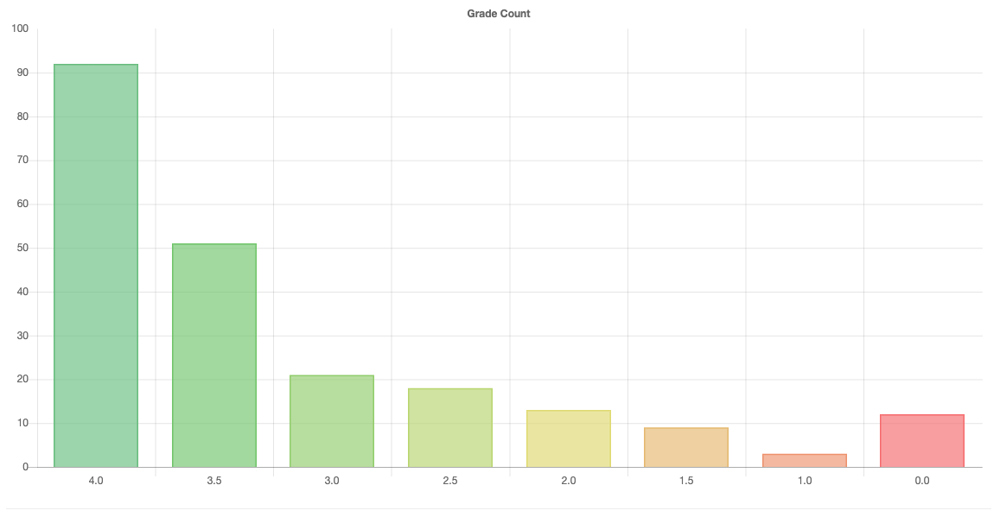
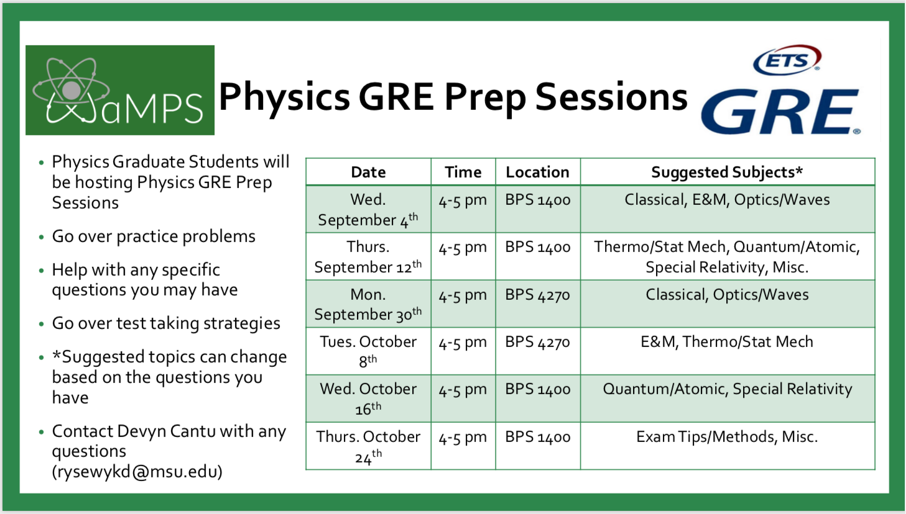

<section data-markdown>
## Welcome to PHY 481

### Electrostatics

Prof. Danny Caballero

</section>

<section data-markdown>
### Contacting Danny (he/him/his)

Office: 1310-A BPS

Email: <caballero@pa.msu.edu>

### Contacting Bryan Stanley (he/him/his)

Office: 1310-C BPS

Email: <stanl142@msu.edu>

</section>

<section data-markdown>
### Important Sites

* Course Webpage: [dannycab.github.io/phy481msu_f2019/](http://dannycab.github.io/phy481msu_f2019/)
* Slack Team: [msuphysics481fall2019.slack.com](http://msuphysics481fall2019.slack.com)
  * *Invite link in syllabus*

</section>

<section data-markdown>

### Course Activities
* Evening Exams (2 of them) - 20% each
  * 1415 BPS; Oct 2 and Nov 6; 7-9pm
* Final Exam (Dec 10: 1415 BPS) - 20%
* Homework (Lots of it; Due on Fridays) - 40%
* Clickers - Extra Credit for Lowest Midterm

[Much more detail on website](http://dannycab.github.io/phy481msu_f2019/)

</section>

<section data-markdown>

### Grading Scheme

* 4.0 - 90-100
* 3.5 - 80-90
* 3.0 - 70-80
* 2.5 - 65-70
* 2.0 - 60-65
* 1.5 - 55-60
* 1.0 - 50-55
* 0.0 - Below 50

I do not curve grades.

</section>

<section data-markdown>

## Historical Grades in 481

</section>

<section data-markdown>
### Clickers

Self-register your clicker

[https://goo.gl/nrebCr](https://tinyurl.com/yxzbrcf6)

Type the 8 digit code on the back of the clicker next to your name. If you can't read the code, please come see me.

**I give you credit for any click.**

</section>

<section data-markdown>
### Exam Re-writes

Exams can be very stressful.

* For both Exam 1 and 2, you will be allowed to rework the exams to earn up to 50% of the credit back.

* You will need to rework the exam and turn in a page that addresses what you did incorrectly.
</section>

<section data-markdown>

Learning is a social and collaborative act!

### Homework Help Session

**Evening sessions twice per week (1300 BPS)**

Question to you: When should we do this?

1. Wednesday 6-7pm
2. Wednesday 7-8pm
3. Thursday 6:30-7:30pm
4. Thursday 7:30-8:30pm
5. None of these times work

Reminder: Homework is due on Fridays.

</section>

<section data-markdown>

How likely are you to attend the help sessions?

1. Very likely
2. Likely
3. Not likely, I really want a different day/time
4. I’m unlikely to attend regardless of schedule

</section>

<section data-markdown>

## This Week!!!

* Homework 1 is already up (Due Fri. Sept. 6)
* Read (seriously do this!) Griffiths Ch 1.1-1.4 & 2.1-2.2 [1]
* [Download Anaconda distribution of Python](https://www.continuum.io/downloads)

**Stay up-to-date by checking website, calendar, and Slack regularly.**

[1]: *I am assuming that Ch. 1 of Griffiths is mostly review.*

</section>

<section data-markdown>

### Computational Homework problems

* We will be using Python on homework problems this semester.
* Installation instructions will appear on the Slack team site.
* Homework questions will take the form of [a Jupyter notebook](https://github.com/dannycab/phy481msu/blob/gh-pages/jupyter/HW1-GradientProblem.ipynb), which you can print to PDF and turn in.
* If you get stuck somewhere, post on Slack, so your classmates benefit from your question.
* Computational HW problems are turned in via Dropbox file requests. *Look for link at the top of each homework assignment and include your name in the filename!*

</section>

<section data-markdown>

### Commitment to an Inclusive Classroom

I am committed to creating an inclusive classroom.  If I can do anything to make the classroom a better learning environment for you, please let me know.

If you observe or experience behaviors that violate our committment to inclusivity, please let me know as soon as possible.

If I violate this principle, please let me know or please tell the undergraduate department chair, Stuart Tessmer (<tessmer@pa.msu.edu>).

</section>

<section data-markdown>

### Confidentiality and Mandatory Reporting

One of my responsibilities is to help create a safe learning environment. It is my goal that you feel able to share information related to your life experiences. I will seek to keep information you share private.

However, I am required to share information regarding sexual misconduct, relationship violence, or information about criminal activity with the University.

</section>

<section data-markdown>

### Confidentiality and Mandatory Reporting

Students may speak to someone confidentially by contacting:
- MSU Counseling and Psychiatric Service (CAPS)
  - caps.msu.edu or ph: 517-355-8270
- MSU’s 24-hour Sexual Assault Crisis Line
  - endrape.msu.edu or ph: 517-372-6666
- Olin Health Center
  - olin.msu.edu or ph: 517-884-6546

</section>

<section data-markdown>
### Spartan Code of Honor Academic Pledge

As a Spartan, I will strive to uphold values of the highest ethical standard. I will practice honesty in my work, foster honesty in my peers, and take pride in knowing that honor is worth more than grades. I will carry these values beyond my time as a student at Michigan State University, continuing the endeavor to build personal integrity in all that I do.

</section>

<section data-markdown>
### Advice from those who came before you

* Go to class every day and participate in the clicker questions/discussion
* The homework is challenging but very important, don't short cut it
* Start your homework early and spend your time on understanding all of it
* Don't do it alone; form study groups
* Attend the help session, but start the homework first
* Danny is never trying to trick you.

</section>

<section data-markdown>

# Questions?

</section>

<section data-markdown>

## What do you think PHY 481 is about?

</section>

<section data-markdown>

### Electromagnetism is the foundational field theory of physics

Think about everything you already know about electromagnetism (it's a lot already!).

Work with a partner to map out the electromagnetism concepts that you know and how they are related to each other.

</section>

<section data-markdown>

</section>
