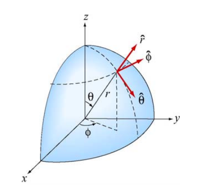

<section data-markdown>

In a typical Cartesian coordinate system, vector $\mathbf{A}$ lies along the $+\hat{x}$ direction and vector $\mathbf{B}$ lies along the $-\hat{y}$ direction. What is the direction of $\mathbf{A} \times \mathbf{B}$?

1. $-\hat{x}$
2. $+\hat{y}$
3. $+\hat{z}$
4. $-\hat{z}$
5. Can't tell

Note:
* Correct Answer: D
* Use the right-hand rule
* Fall 2016: 0 0 23 [77]

</section>

<section data-markdown>

In a typical Cartesian coordinate system, vector $\mathbf{A}$ lies along the $+\hat{x}$ direction and vector $\mathbf{B}$ lies along the $-\hat{y}$ direction. What is the direction of $\mathbf{B} \times \mathbf{A}$?

1. $-\hat{x}$
2. $+\hat{y}$
3. $+\hat{z}$
4. $-\hat{z}$
5. Can't tell

Note:
* Correct Answer: C
* Use right-hand rule; means $\mathbf{A} \times \mathbf{B} = - \mathbf{B} \times \mathbf{A}$
* Fall 2016: 0 0 [94] 6 0
</section>

<section data-markdown>

### You derive it

Consider the radial unit vector ($\hat{r}$) in the spherical coordinate system as shown in the figure to the right.

Determine the $z$ component of this unit vector in the Cartesian $(x,y,z)$ system as a function of $r,\theta,\phi$.

Note:
This demonstrates that the r unit vector is a curious thing, in fact in contains all the information that is needed to define where you on the unit sphere. The other vectors can be though of as defined relative to that.
Altered for F2017 to be shorter, only work on z component
</section>
<section data-markdown>

In cylindrical (2D) coordinates, what would be the correct description of the position vector $\mathbf{r}$ of the point P shown at $(x,y) = (1, 1)$?

1. $\mathbf{r} = \sqrt{2} \hat{s}$
2. $\mathbf{r} = \sqrt{2} \hat{s} + \pi/4 \hat{\phi}$
3. $\mathbf{r} = \sqrt{2} \hat{s} - \pi/4 \hat{\phi}$
4. $\mathbf{r} = \pi/4 \hat{\phi}$
5. Something else entirely

Note:
* CORRECT ANSWER:  A
* Fall 2016: [6] 90 3 0 1; Second vote (discussion and hint about units): [54] 35 4 1 4

</section>

<section data-markdown>

How is the vector $\mathfrak{R}_{12}$ related to $\mathbf{r}_1$ and  $\mathbf{r}_2$?

1. $\mathfrak{R}_{12} = \mathbf{r}_1 +\mathbf{r}_2$
1. $\mathfrak{R}_{12} = \mathbf{r}_1 - \mathbf{r}_2$
1. $\mathfrak{R}_{12} = \mathbf{r}_2 - \mathbf{r}_1$
4. None of these

Note:
* CORRECT ANSWER:  C
* Fall 2016: 6 1 [91] 1 0

</section>

<section data-markdown>

Coulomb's Law: $\mathbf{F}  = \frac{k q_1 q_2}{\left|\mathfrak{R}\right|^2}\hat{\mathfrak{R}}$ where $\mathfrak{R}$ is the relative position vector. In the figure, $q_1$ and $q_2$ are 2 m apart. Which arrow **can** represent $\hat{\mathfrak{R}}$?

1. A
2. B
3. C
4. More than one (or NONE) of the above
5. You can't decide until you know if $q_1$ and $q_2$ are the same or opposite charges

Note:
* CORRECT ANSWER: D
* A unit vector has no units; so it's length is meaningless on a picture with units.
* Fall 2016 (hint given while still open): 14 10 9 [44] 23; students wanted to discuss E

</section>
