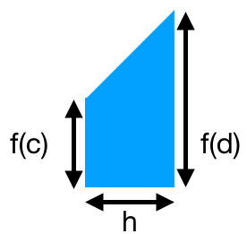

<section data-markdown>

This diagram shows the field of a positive point charge. What is the divergence in the boxed region?

1. Zero
2. Not zero
3. ???

Note:
* CORRECT ANSWER: A
* Lines in; lines out - harder to see dE/dx and dE/dy
* One of those curious ones where the 2D picture might get in the way; think 3D

</section>

<section data-markdown>

For me, the first homework was ...

1. entirely a review.
2. mostly a review, but it had a few new things in it.
3. somewhat of a review, but it had quite a few new things in it.
4. completely new for me.

</section>

<section data-markdown>
I spent ... hours on the first homework.

1. 1-2
2. 3-4
3. 5-6
4. 7-8
5. More than 9
</section>

<section data-markdown>
Consider a vector field defined as the gradient of some well-behaved scalar function:
$$\mathbf{v}(x,y,z) = \nabla T(x,y,z).$$

What is the value of $\oint_C \mathbf{v} \cdot d\mathbf{l}$?

1. Zero
2. Non-zero, but finite
3. Can't tell without a function for $T$

Note:
* CORRECT ANSWER: A
* Closed loop integral of a gradient is zero.
* Fall 2016: [92] 4 4 0 0

</section>

<section data-markdown>

## Numerical Integration

</section>

<section data-markdown>

Consider this trapezoid

What is the area of this trapezoid?

1. $f(c)h$
2. $f(d)h$
3. $f(c)h + \frac{1}{2}f(d)h$
4. $\frac{1}{2}f(c)h + \frac{1}{2}f(d)h$
5. Something else

Note:
* Correct Answer: D
</section>

<section data-markdown>

The trapezoidal rule for a function $f(x)$ gives the area of the $k$th slice of width $h$ to be,

$$A_{k} = \frac{1}{2}h\left(f(a+(k-1)h) + f(a+kh)\right)$$

What is the approximate integral, $I(a,b) = \int_a^b f(x) dx$, $I(a,b) \approx$

1. $\sum_{k=1}^N \frac{1}{2}h\left(f(a+(k-1)h) + f(a+kh)\right)$
2. $h\left(\frac{1}{2}f(a) + \frac{1}{2}f(b) + \frac{1}{2}\sum_{k=1}^{N-1}f(a+kh)\right)$
3. $h\left(\frac{1}{2}f(a) + \frac{1}{2}f(b) + \sum_{k=1}^{N-1}f(a+kh)\right)$
4. None of these is correct.
4. More than one is correct.

Note:
* Correct Answer: D (both A and C)

</section>

<section data-markdown>

The trapezoidal rule takes into account the value and slope of the function. The next "best" approximation will also take into account:

1. Concavity of the function
2. Curvature of the function
3. Unequally spaced intervals
4. More than one of these
5. Something else entirely

</section>
