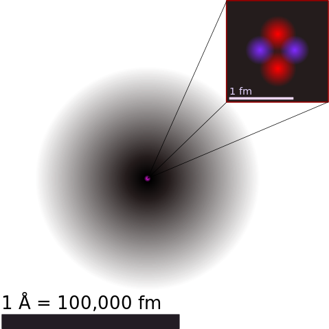
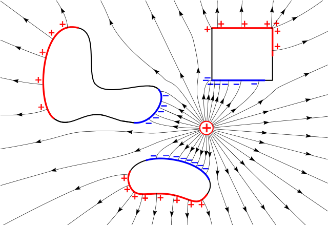
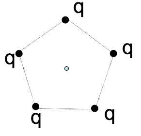

<section data-markdown>

Two small spheres (mass, $m$) are attached to insulating strings (length, $L$) and hung from the ceiling as shown.

How does the angle (with respect ot the vertical) that the string attached to the $-q$ charge ($\theta_1$) compare to that of the $-2q$ charge ($\theta_2$)?

1. $\theta_1 > \theta_2$
2. $\theta_1 = \theta_2$
3. $\theta_1 < \theta_2$
4. ????

Note:
CORRECT ANSWER: B
Draw the FBD, Newton 3 is important here.

</section>

<section data-markdown>
# MORE SHAMING
</section>

<section data-markdown>

## Register your clicker

* Allen, Grant
* Bertus, Thomas
* Byrd, Benjamin
* Dara, Jacob
* Ding, Fang
* Evasic, Jacob
* Fowler, David

</section>

<section data-markdown>

## Register your clicker

* Lewis, Jim
* Li, Zihan
* Myers, Cody
* Wallace, Ian
* Ward, Jenny
* Wicklund, Courtney
* Xu, Fu

</section>

<section data-markdown>
## Classical Electromagnetism

$\sim 10^8\mathrm{m} \longrightarrow \longrightarrow \longrightarrow\longrightarrow\longrightarrow\longrightarrow \sim 10^{-16}\mathrm{m}$

**24 orders of magnitude**

Note: As far we know, the theory of Classical E&M works for 24 orders of magnitude. It breaks down on the subatomic scale (QM), but we really don't know how far it extends one the upper-end as it is consistent with relativity. Tests of Jupiter's magnetic field are consistent with predictions from Classical E&M.

</section>

<section data-markdown>
## Electrostatics

</section>

<section data-markdown>

5 charges, q, are arranged in a regular pentagon, as shown.
What is the E field at the center?

1. Zero
2. Non-zero
3. Really need trig and a calculator to decide

Note:
CORRECT ANSWER: A
</section>

<section data-markdown>

1 of the 5 charges has been removed, as shown. What’s the E field at the center?

1. $+(kq/a^2)\hat{y}$
2. $-(kq/a^2)\hat{y}$
3. 0
4. Something entirely different!
5. This is a nasty problem which I need more time to solve

Note:
CORRECT ANSWER:  B
Superposition!

</section>

<section data-markdown>

If all the charges live on a line (1-D), use:

$$ \lambda \equiv \dfrac{\mathrm{charge}}{\mathrm{length}}$$

Draw your own picture. What's $\mathbf{E}(\mathbf{r})$?

</section>

<section data-markdown>

To find the E-field at P from a thin line (uniform charge density $\lambda$):

$$ \mathbf{E}(\mathbf{r}) = \dfrac{1}{4\pi\varepsilon_0}\int \dfrac{\lambda dl'}{\mathfrak{R}^2}\hat{\mathfrak{R}}$$
What is $\mathfrak{R}$?

1. $x$
2. $y'$
3. $\sqrt{dl'^2 + x^2}$
4. $\sqrt{x^2+y'^2}$
5. Something else

Note:
CORRECT ANSWER: D

</section>

<section data-markdown>

$\mathbf{E}(\mathbf{r}) = \int \dfrac{\lambda dl'}{4\pi\varepsilon_0\mathfrak{R}^3}\vec{\mathfrak{R}}$, so: $E_x(x,0,0) = \dfrac{\lambda}{4\pi\varepsilon_0}\int \dots$

1. $\int \dfrac{dy'x}{x^3}$
2. $\int \dfrac{dy' x}{(x^2 + y'^2)^{3/2}}$
3. $\int \dfrac{dy' y'}{x^3}$
4. $\int \dfrac{dy' y'}{(x^2+y'^2)^{3/2}}$
5. Something else

Note:
CORRECT ANSWER: B

</section>

<section data-markdown>

What do you expect to happen to the field as you get really far from the rod?

$$E_x = \dfrac{\lambda}{4\pi\varepsilon_0\}\dfrac{L}{x\sqrt{x^2+L^2}}$$

1. $E_x$ goes to 0.
2. $E_x$ begins to look like a point charge.
3. $E_x$ goes to $\infty$.
4. More than one of these is true.
5. I can't tell what should happen to $E_x$.

Note:
CORRECT ANSWER: D (A and B)

</section>
