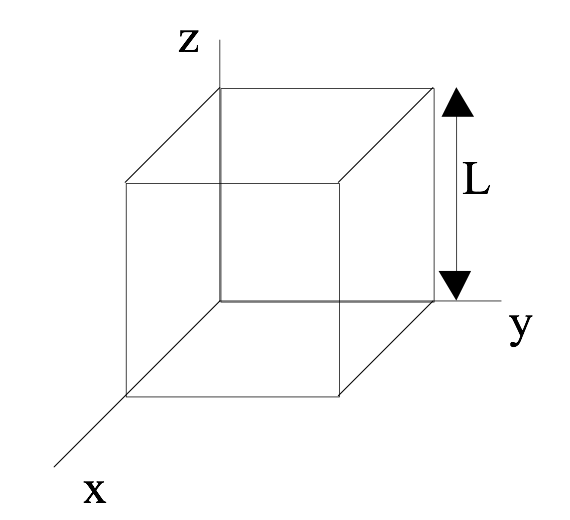
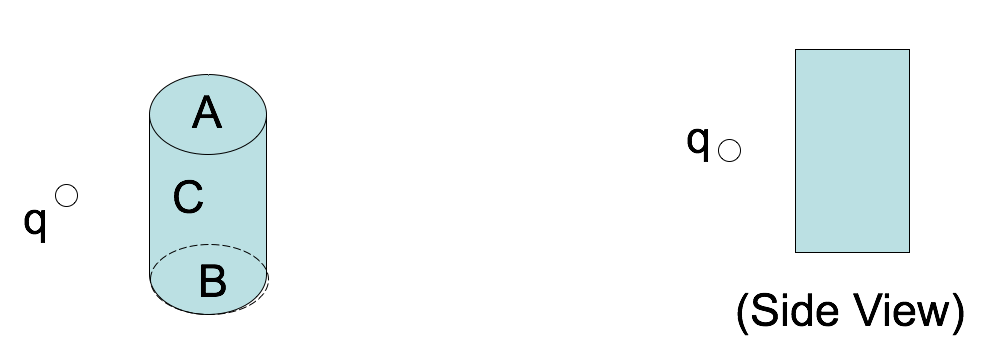
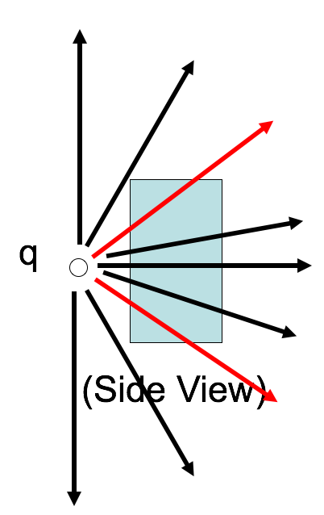

<section data-markdown>

Which of the following are vectors?

(I) Electric field, (II) Electric flux, and/or (III) Electric charge

1. I only
2. I and II only
3. I and III only
4. II and III only
5. I, II, and II

Note:
* CORRECT ANSWER: A

</section>

<section data-markdown>

Given the location of the little bit of charge ($dq$), what is $|\vec{\mathfrak{R}}|$?

1. $\sqrt{z^2+r'^2}$
2. $\sqrt{z^2+r'^2-2zr'\cos\theta}$
3. $\sqrt{z^2+r'^2+2zr'\cos\theta}$
4. Something else

Note:
CORRECT ANSWER: B

</section>

<section data-markdown>

## Gauss' Law

$$\oint_S \mathbf{E}\cdot d\mathbf{A} = \int_V \dfrac{\rho}{\varepsilon_0}d\tau$$

</section>

<section data-markdown>

The space in and around a cubical box (edge length $L$) is filled with a constant uniform electric field, $\mathbf{E} = E_0 \hat{y}$. What is the TOTAL electric flux $\oint_S \mathbf{E} \cdot d\mathbf{A}$ through this closed surface?

1. 0
2. $E_0L^2$
3. $2E_0L^2$
4. $6E_0L^2$
5. We don't know $\rho(r)$, so can't answer.

Note:
* CORRECT ANSWER: A
* All the incoming flux on the left side comes out the right side

</section>

<section data-markdown>
A positive point charge $+q$ is placed outside a closed cylindrical surface as shown.  The closed surface consists of the flat end caps (labeled A and B) and the curved side surface (C). What is the sign of the electric flux through surface C?

1. positive
2. negative
3. zero
4. not enough information given to decide

Note:
* CORRECT ANSWER: B
* This is meant to be hard to visualize, next slide illustrates it better.

</section>

<section data-markdown>

Let's get a better look at the side view.

</section>

<section data-markdown>
A positive point charge $+q$ is placed outside a closed cylindrical surface as shown.  The closed surface consists of the flat end caps (labeled A and B) and the curved side surface (C). What is the sign of the electric flux through surface C?

1. positive
2. negative
3. zero
4. not enough information given to decide

Note:
* CORRECT ANSWER: B
* Some of the incoming flux through C goes out A and B.

</section>

<section data-markdown>

Which of the following two fields has zero divergence?

| I | II |
|:-:|:-:|
|  |  |

1. Both do.
2. Only I is zero
3. Only II is zero
4. Neither is zero
5. ???

Note:
* CORRECT ANSWER: B
* Think about dE/dx and dE/dy
* Fall 2016: 7 [34] 13 43 3; (Asked them to consider dvx/dx and dvy/dy) 3 [90] 3 4 0

</section>

<section data-markdown>

What is the divergence in the boxed region?

1. Zero
2. Not zero
3. ???

Note:
* CORRECT ANSWER: A
* Lines in; lines out - harder to see dE/dx and dE/dy
* One of those curious ones where the 2D picture might get in the way; think 3D

</section>
