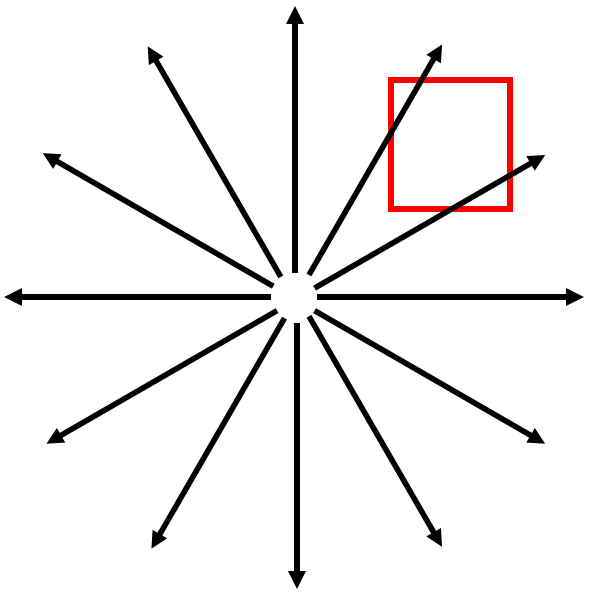

<section data-markdown>

This picture represents the field lines of a single positive point charge.

What is the divergence in the boxed region? What is the divergence of the whole field?

1. Boxed region is zero; whole field is zero
2. Boxed region is non-zero; whole field is zero
3. Boxed region is zero; whole field is non-zero
4. Boxed region is non-zero; whole field is non-zero
5. ???

Note:
* CORRECT ANSWER: C

</section>

<section data-markdown>

**Activity:** For a the electric field of a point charge, $\mathbf{E}(\mathbf{r}) = \dfrac{1}{4\pi\varepsilon_0}\dfrac{q}{r^2}\hat{r}$, compute $\nabla \cdot \mathbf{E}$.

*Hint: The front fly leaf of Griffiths suggests that the we take:*
$$\dfrac{1}{r^2}\dfrac{\partial}{\partial r}\left(r^2 E_r\right)$$

Note:
* You get zero! Motivates delta function

</section>

<section data-markdown>

Remember this?

</section>

<section data-markdown>

What is the value of:

$$\int_{-\infty}^{\infty} x^2 \delta(x-2)dx$$

1. 0
2. 2
3. 4
4. $\infty$
5. Something else

Note:
* CORRECT ANSWER: C

</section>

<section data-markdown>

**Activity**: Compute the following integrals. Note anything special you had to do.

* Row 1-2: $\int_{-\infty}^{\infty} xe^x \delta(x-1)dx$
* Row 3-4: $\int_{\infty}^{-\infty} \log(x) \delta(x-2)dx$
* Row 5-6: $\int_{-\infty}^{0} xe^x \delta(x-1)dx$
* Row 6+: $\int_{-\infty}^{\infty} (x+1)^2 \delta(4x)dx$

Note:
* Give them 2-3 minutes to work on it and ask for what they did.

</section>

<section data-markdown>

Compute:

$$\int_{-\infty}^{\infty} x^2\delta(3x+5)dx$$

1. $25/3$
2. $-5/3$
3. $25/27$
4. $25/9$
5. Something else

Note:
* CORRECT ANSWER: C
* Use a u substitution.

</section>

<section data-markdown>
A point charge ($q$) is located at position $\mathbf{R}$, as shown. What is $\rho(\mathbf{r})$, the charge density in all space?

1. $\rho(\mathbf{r}) = q\delta^3(\mathbf{R})$
2. $\rho(\mathbf{r}) = q\delta^3(\mathbf{r})$
3. $\rho(\mathbf{r}) = q\delta^3(\mathbf{R}-\mathbf{r})$
4. $\rho(\mathbf{r}) = q\delta^3(\mathbf{r}-\mathbf{R})$
5. Something else??

Note:
* CORRECT ANSWER: E
* This one is a curious one because a delta function is always positive, both C and D are correct.
* Expect most everyone to pick C

</section>

<section data-markdown>

What are the units of $\delta (x)$ if $x$ is measured in meters?

1. $\delta(x)$ is dimension less (‘no units’)
2. [$\mathrm{m}$]:      Unit of length
3. [$\mathrm{m}^2$]:    Unit of length squared
4. [$\mathrm{m}^{-1}$]:   1 / (unit of length)
5. [$\mathrm{m}^{-2}$]:   1 / (unit of length squared)

Note:
* CORRECT ANSWER: D
* Think about what the integral must produce.

</section>

<section data-markdown>

What are the units of $\delta^3(\mathbf{r})$ if the components of $\mathbf{r}$ are measured in meters?

1. [$\mathrm{m}$]:      Unit of length
2. [$\mathrm{m}^2$]:    Unit of length squared
3. [$\mathrm{m}^{-1}$]:   1 / (unit of length)
4. [$\mathrm{m}^{-2}$]:   1 / (unit of length squared)
5. None of these.

Note:
* CORRECT ANSWER: E
* Should be m^-3

</section>

<section data-markdown>

What is the divergence in the boxed region?

1. Zero
2. Not zero
3. ???

Note:
* CORRECT ANSWER: A
* Just a check back in.
</section>

<section data-markdown>

We have shown twice that $\nabla \cdot \mathbf{E} = 0$ using what seem to be appropriate vector identities. But physically, $\nabla \cdot \mathbf{E} = \rho/ \varepsilon_0$. What is going on?!

1. We broke physics - let's call it a day
2. There's some trick to get out of this and that makes me uncomfortable
3. I can see what we need to do
4. ???

</section>
