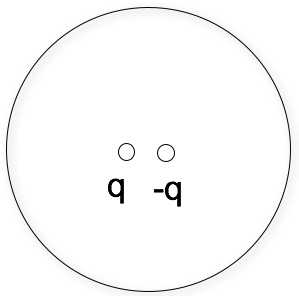

<section data-markdown>

What is the total charge for this distribution?

$$\rho(\mathbf{r}) = \sum_{k=0}^2 (1+k)\,q\,\delta^3(\mathbf{r}-k\mathbf{a})$$

1. q
2. 2 q
3. 4 q
4. 6 q
5. Something else

Note:
* Correct Answer: D (write it out)
* Follow up what does it look like?

</section>

<section data-markdown>

## Announcements

* Exam 1 is coming up! October 2nd (More details next week!)
* And I will post practice exams to Slack!

</section>

<section data-markdown>

A Gaussian surface which is *not* a sphere has a single charge (q) inside it, *not* at the center. There are more charges outside. What can we say about total electric flux through this surface $\oint_S \mathbf{E} \cdot d\mathbf{A}$?

1. It is $q/\varepsilon_0$.
2. We know what it is, but it is NOT $q/\varepsilon_0$.
3. Need more info/details to figure it out.

Note:
* CORRECT ANSWER: A

</section>

<section data-markdown>

A Gaussian surface which is *not* a sphere has a single charge (q) inside it, *not* at the center. There are more charges outside. Can we use Gauss's Law ($\oint_S \mathbf{E} \cdot d\mathbf{A}$) to find $|\mathbf{E}|$?

1. Yes
2. No
3. Maybe?

Note:
* CORRECT ANSWER: B

</section>

<section data-markdown>

An electric dipole ($+q$ and $–q$, small distance $d$ apart) sits centered in a Gaussian sphere.

What can you say about the flux of $\mathbf{E}$ through the sphere, and $|\mathbf{E}|$ on the sphere?

1. Flux = 0, E = 0 everywhere on sphere surface
2. Flux = 0, E need not be zero *everywhere* on sphere
3. Flux is not zero, E = 0 everywhere on sphere
4. Flux is not zero, E need not be zero...

Note:
* CORRECT ANSWER: B
* Think about Q enclosed; what can we say about E though?

</section>

<section data-markdown>

SLAC (Stanford Linear Accelerator Center) is where quarks (including the charm
quark), and the tauon (like a heavier electron) were discovered.

Note: Charged particles are accelerated inside a long metal cylindrical pipe, which is 2 miles long and has a radius R = 6 cm. All the air is pumped out of this pipe, known as the "beam line."
</section>

<section data-markdown>

One afternoon, the beam line is struck by lightning, which gives it a uniform
surface charge density $+\sigma$. Does that affect the experiment?!

What is the infinitesimal area, $dA$, of a small patch on a cylindrical shell centered
on the z-axis?

1. $d\phi\,dz$
2. $s\,d\phi\,dz$
3. $s\,ds\,d\phi$
4. $ds\,dz$
5. Something else

Note: Correct answer B

</section>

<section data-markdown>

Which way does the electric field due to the positive charges resting on the beam line point for locations _outside the pipe_ far from the ends?

1. Roughly radially outward
2. Exactly radially outward
3. Roughly radially inward
4. Exactly radially inward
5. It varies too much to tell

Note: Correct answers A and B; talk about models and modeling

</section>

<section data-markdown>

Which way does the electric field due to the positive charges resting on the beam line point for locations _inside the pipe_ far from the ends?

1. Exactly radially outward
2. Exactly radially inward
3. It varies too much to tell
4. Something else

Note: Correct answer D; it zero

</section>

<section data-markdown>
Consider a spherical Gaussian surface. What is the $d\mathbf{A}$ in $\int\int\mathbf{E}\cdot d\mathbf{A}$?

1. $r d\theta d\phi \hat{r}$
2. $r^2 d\theta d\phi \hat{r}$
3. $r \sin \theta d\theta d\phi \hat{r}$
4. $r^2 \sin \theta d\theta d\phi \hat{r}$
5. Something else

Note:
* Correct Answer: D
</section>

<section data-markdown>

Consider an infinite sheet of charge with uniform surface charge density $+\sigma$ lying in the $x-y$ plane. From symmetry arguments, we can argue that $\mathbf{E}(x,y,z)$ can be simplified to:

1. $\mathbf{E}(x,y)$; direction undetermined
2. $E_z(x,y)$
3. $\mathbf{E}(z)$; direction undetermined
4. $E_z(z)$
5. Something else

</section>

<section data-markdown>

We derived that the electric field due to an infinite sheet with charge density $\sigma$ was as follows:

$$\mathbf{E}(z) = \begin{cases} \dfrac{\sigma}{2\varepsilon_0}\hat{k} & \mbox{if} & \mbox{ z > 0} \cr \dfrac{-\sigma}{2\varepsilon_0}\hat{k} & \mbox{if} & \mbox{ z < 0}\end{cases}$$

What does that tell you about the difference in the field when we cross the sheet, $\mathbf{E}(+z)-\mathbf{E}(-z)$?

1. it's zero
2. it's ${\sigma}/{\varepsilon_0}$
3. it's -${\sigma}/{\varepsilon_0}$
4. it's +${\sigma}/{\varepsilon_0} \hat{k}$
5. it's -${\sigma}/{\varepsilon_0} \hat{k}$

Note:
* CORRECT ANSWER: D
* Makes for a good discussion about cross one direction versus the other

</section>
