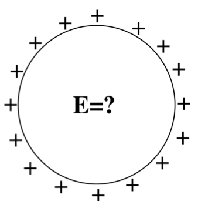

<section data-markdown>

A spherical *shell* has a uniform positive charge density on its surface. (There are no other charges around.)

What is the electric field *inside* the sphere?
1. $\mathbf{E}=0$ everywhere inside
2. $\mathbf{E}$ is non-zero everywhere in the sphere
3. $\mathbf{E}=0$ only that the very center, but non-zero elsewhere inside the sphere.
4. Not enough information given

Note:
* Correct Answer: A
</section>

<section data-markdown>
### Exam 1 Information

* Exam 1 on Wednesday, October 3rd (BCH 101)
  - Next to BPS (Wilson side)
* 7pm-9pm
  - Arrive on time!
  - Put one seat between you and the next person
* I will provide a formula sheet (posted on Slack already)
* You can bring one-side of a sheet of paper with your own notes.
* 5 questions - True/False, Essay, Code, Graphing, Short Calculations

</section>

<section data-markdown>

### What's on Exam 1?

* Identify whether conceptual statements about $\mathbf{E}$, $V$, $\rho$, and/or numerical integration are true or false.
* Sketch and discuss delta functions in relation to charge density, $\rho$
* Explain the process for using a computational alogrithm for predicting $\mathbf{E}$ and write the necessary code to illustrate how it works for a given example
* Calculate the electric field, $\mathbf{E}$, inside and outside a continuous distribution of charge and sketch the results
* Calculate the electric potential, $V$, for a specific charge distribution and discuss what happens in limiting cases

</section>

<section data-markdown>

We are trying to compute the the electric potential $V(\mathbf{r})$ for a line of charge at the location $\langle x,0,z \rangle$. What is $|\mathfrak{R}|$ in this case?

1. $x$
2. $z$
3. $\sqrt{x^2+z^2}$
4. Something else

Note: Correct Answer D (needs to have z')

</section>

<section data-markdown>

We derived the potential for this short rod to be

$V(x,z) = \dfrac{\lambda}{4\pi\varepsilon_0}\log\left[\dfrac{L+z+\sqrt{x^2+(L+z)^2}}{L-z+\sqrt{x^2+(L-z)^2}}\right]$

The associated electric field at $\langle x,0,z\rangle$ location can have the following components:

1. only x
2. only y
3. only z
4. x, y, and z
5. Something else

</section>

<section data-markdown>

A spherical *shell* has a uniform positive charge density on its surface. (There are no other charges around.)

What is the electric field *inside* the sphere?
1. $\mathbf{E}=0$ everywhere inside
2. $\mathbf{E}$ is non-zero everywhere in the sphere
3. $\mathbf{E}=0$ only that the very center, but non-zero elsewhere inside the sphere.
4. Not enough information given

Note:
* Correct Answer: A
</section>

<section data-markdown>

We derived the electric potential outside ($r>R$) the charged shell to be

$$V(r) = \dfrac{1}{4\pi\varepsilon_0}\dfrac{q}{r}$$

What is it for $r<R$?

1. Zero
2. Constant
3. It changes but I don't know how yet
4. Something else

Note:
* Correct Answer: B

</section>

<section data-markdown>

Could this be a plot of $\left|\mathbf{E}(r)\right|$? Or $V(r)$? (for SOME physical situation?)

1. Could be $E(r)$, or $V(r)$
2. Could be $E(r)$, but can't be $V(r)$
3. Can't be $E(r)$, could be $V(r)$
4. Can't be either
5. ???

Note:
* Correct Answer: B

</section>
