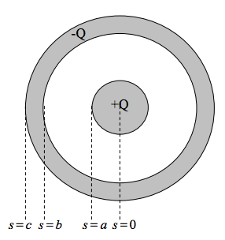
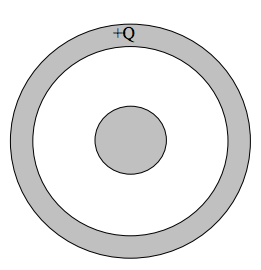

<section data-markdown>

A typical metal has one free election per atom. These electrons are free to move in response to external electric fields. There are $\sim 10^{22}$ free electrons in a cubic centimeter of copper. Roughly what size of electric field could a single 1cm sub of copper "respond" to by polarizing?

1. 1 N/C
2. 10 N/C
3. 100 N/C
4. 1000 N/C
5. Something more than these

Note: Correct answer is E. It's closer to 10e17 N/C

</section>

<section data-markdown>

### Announcements

* Test on Wednesday (7-9pm) BCH 101
  * All Homework solutions posted on Slack
  * You may bring in one side of a piece of paper with your own notes

</section>

<section data-markdown>

</section>

<section data-markdown>

### Conductors

</section>

<section data-markdown>

### The conductor problem

</section>

<section data-markdown>

A point charge $+q$ sits outside a **solid neutral conducting copper sphere** of radius $A$. The charge q is a distance $r > A$ from the center, on the right side. What is the E-field at the center of the sphere? (Assume equilibrium situation).

1. $|E| = kq/r^2$, to left
2. $kq/r^2 > |E| > 0$, to left
3. $|E| > 0$, to right
4. $E = 0$
5. None of these

Note:
* CORRECT ANSWER: D
* Net electric field inside of a metal in static equilibrium is zero
* Talk about the net field versus the field due to the charges on the metal.

</section>

<section data-markdown>

In the previous question, suppose **the copper sphere is charged**, total charge $+Q$. (We are still in static equilibrium.) What is now the magnitude of the E-field at the center of the sphere?

1. $|E| = kq/r^2$
2. $|E| = kQ/A^2$
3. $|E| = k(q-Q)/r^2$
4. $|E| = 0$
5. None of these! / it’s hard to compute

Note:
* CORRECT ANSWER: D
* Talk about the net field versus the field due to the charges on the metal.
</section>

<section data-markdown>

Consider a long coaxial with charge $+Q$ placed on the inside metal wire and $-Q$ outside metal sheath as shown.

Sketch the distribution of charge in this situtation using plus signs to represent positive chages and minus signs to represent negative charges.

Note:
* Ask them for answers, put up on board and turn into clicker question
* Answer should be plusses on outside of inner and minuses inside of outer (equal numbers)

</section>

<section data-markdown>

If you were calculating the potential difference, $\Delta V$, between the center of the inner conductor ($s=0$) and infinitely far away ($s \rightarrow \infty$), what regions of space would have a (non-zero) contribution to your calculation?

1. $s<a$
2. $a<s<b$
3. $b<s<c$
4. $s>c$
5. More than one of these

Note:
* Correct answer: E
* Should be where the metal is

</section>

<section data-markdown>

Now, draw the charge distribution (little + and – signs) if the inner conductor has a total charge $+Q$ on it, and the outer conductor is electrically neutral.

Note:
* Ask them for answers, put up on board and turn into clicker question
* Answer should be plusses on outside of inner and minuses inside of outer and plusses on outside of outer (equal numbers)

</section>

<section data-markdown>

Consider how the charge distribution would change if the inner conductor is shifted off-center, but still has $+Q$ on it, and the outer conductor remains electrically neutral. Draw the new charge distribution (little + and – signs) and be precise about how you know.

Note:
* Ask them for answers, put up on board and turn into clicker question
* Answer should be plusses on outside of inner and minuses inside of outer and plusses on outside of outer (equal numbers); shift only on outside of inner and inside of outer (no net field from them)

</section>

<section data-markdown>

Return the inner conductor to the center.

Instead of the total charge $+Q$ being on the inner conductor, sketch the charge distribution (little + and – signs) if the outer conductor has a total charge $+Q$ on it, and the inner conductor is electrically neutral. Be precise about exactly where the charge will be on these conductors, and how you know.

Note:
* Ask them for answers, put up on board and turn into clicker question
* Answer should be plusses on outside of outer; nothing else.

</section>
