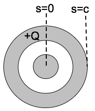
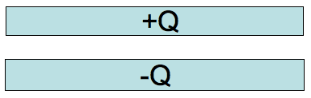

<section data-markdown>

We have a large copper plate with uniform surface charge density, $\sigma$.
Imagine the Gaussian surface drawn below.  Calculate the E-field a small distance $s$ above the conductor surface.

1. $|E| = \frac{\sigma}{\varepsilon_0}$
2. $|E| = \frac{\sigma}{2\varepsilon_0}$
3. $|E| = \frac{\sigma}{4\varepsilon_0}$
4. $|E| = \frac{1}{4\pi\varepsilon_0}\frac{\sigma}{s^2}$
5. $|E| = 0$

Note:
* CORRECT ANSWER: A
* Might have to do derivation and go through details of infinitely thin line charge. Must be +sigma on other side, btw.

</section>

<section data-markdown>

## Announcements

* Exam 1 TONIGHT (7pm-9pm)
  - 101 BCH
  - Help session tonight: 5-6:30 (1300 BPS)
* DC out of town next Wed night - Friday
  * Help session in limbo at the moment
  * Class on Friday - Dr. Rachel Henderson
</section>

<section data-markdown>

A positive charge ($q$) is outside a metal conductor with a hole cut out of it at a distance $a$ from the center of the hole. What is the *net* electric field at center of the hole?

1. $\dfrac{1}{4 \pi \varepsilon_0}\dfrac{q}{a^2}$
2. $\dfrac{-1}{4 \pi \varepsilon_0}\dfrac{q}{a^2}$
3. $\dfrac{1}{4 \pi \varepsilon_0}\dfrac{2q}{a^2}$
4. $\dfrac{-1}{4 \pi \varepsilon_0}\dfrac{2q}{a^2}$
5. Zero

Note: Correct Answer E
</section>

<section data-markdown>

With $\nabla \times \mathbf{E} = 0$, we know that,

$$\oint \mathbf{E} \cdot d\mathbf{l} = 0$$

If we choose a loop that includes a metal and interior vacuum (i.e., both in and **inside the hole**), we know that the contribution to this integral in the metal vanishes. What can we say about the contribution in the hole?

1. It vanishes also
2. $\mathbf{E}$ must be zero in there
3. $\mathbf{E}$ must be perpendicular to d$\mathbf{l}$ everywhere
4. $\mathbf{E}$ is perpendicular to the metal surface
5. More than one of these

Note:
* Correct answer: E (A and B)

</section>

<section data-markdown>

With $\nabla \times \mathbf{E} = 0$, we know that,

$$\oint \mathbf{E} \cdot d\mathbf{l} = 0$$

If we choose a loop that includes a metal and vacuum (i.e., both in and **just outside of the metal**), we know that the contribution to this integral in the metal vanishes. What can we say about the contribution just outside the metal?

1. It vanishes also
2. $\mathbf{E}$ must be zero out there
3. $\mathbf{E}$ must be perpendicular to d$\mathbf{l}$ everywhere
4. $\mathbf{E}$ is perpendicular to the metal surface
5. More than one of these

Note:
* Correct answer: E (both A and D)

</section>

<section data-markdown>

A neutral copper sphere has a spherical hollow in the center.  A charge $+q$ is placed in the center of the hollow.  What is the total charge on the outside surface of the copper sphere? (Assume Electrostatic equilibrium.)

1. Zero
2. $-q$
3. $+q$
4. $0 < q_{outer} < +q$
5. $-q < q_{outer} < 0$

Note:
* Correct answer: C

</section>

<section data-markdown>

A long coax has total charge $+Q$ on the OUTER conductor. The INNER conductor is neutral.

What is the sign of the potential difference, $\Delta V = V(c)-V(0)$, between the center of the inner conductor ($s = 0$)
and the outside of the outer conductor?

1. Positive
2. Negative
3. Zero

Note:
* CORRECT ANSWER: C; there's no field inside at all

</section>

<section data-markdown>

Given a pair of very large, flat, conducting capacitor plates with total charges $+Q$ and $-Q$. Ignoring edges, what is the equilibrium distribution of the charge?

1. Throughout each plate
2. Uniformly on both side of each plate
3. Uniformly on top of $+Q$ plate and bottom of $–Q$ plate
4. Uniformly on bottom of $+Q$ plate and top of $–Q$ plate
5. Something else

Note:
* CORRECT ANSWER: D

</section>

<section data-markdown>

Given a pair of very large, flat, conducting capacitor plates with surface charge densities $+/-\sigma$, what is the E field in the region between the plates?

1. $\sigma/2\varepsilon_0$
2. $\sigma/\varepsilon_0$
3. $2\sigma/\varepsilon_0$
4. $4\sigma/\varepsilon_0$
5. Something else

Note:
* CORRECT ANSWER: B

</section>
