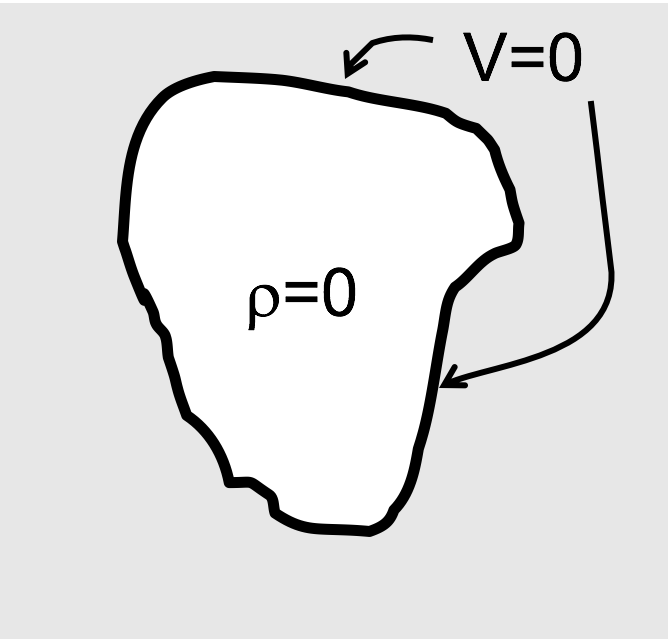
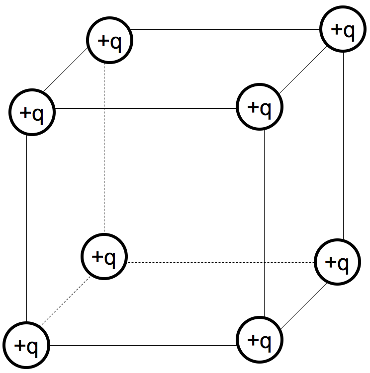

<section data-markdown>

A parallel plate capacitor is attached to a battery which maintains a constant voltage difference V between the capacitor plates.  While the battery is attached, the plates are pulled apart. The electrostatic energy stored in the capacitor

1. increases.
2. decreases.
3. stays constant.

Note:
* CORRECT ANSWER: B
* Potential same; field is reduced; but shows up squared while d is increased, overall goes down
</section>

<section data-markdown>

## Exam Rewrites

* Circled grade is the grade you will earn if you do the rewrite
* To earn the circled grade:
  * Complete the parts that you didn't earn full credit
  * Write one paragraph per problem (max 4 paragraphs) about what you didn't understand at the time of the exam, what you did to correct that understanding, and how that relates to the solution you've written up.

</section>

<section data-markdown>

### Laplace's Equation

</section>

<section data-markdown>

A region of space contains no charges. What can I say about $V$ in the interior?

1. Not much, there are lots of possibilities for $V(r)$ in there
2. $V(r)=0$ everywhere in the interior.
3. $V(r)=$constant everywhere in the interior

Note:
* CORRECT ANSWER: A
* Without the boundary information, we can't solve the problem.
* But once we have BCs, we have a unique answer.

</section>

<section data-markdown>

A region of space contains no charges. The boundary has V=0 everywhere.
What can I say about $V$ in the interior?

1. Not much, there are lots of possibilities for $V(r)$ in there
2. $V(r)=0$ everywhere in the interior.
3. $V(r)=$constant everywhere in the interior

Note:
* CORRECT ANSWER: B
* Uniqueness argues it must be B; satisfies all the results and the BCs

</section>

<section data-markdown>

For the 1D Laplace problem ($\nabla^2 V = \partial^2 V/\partial x^2 = 0$), we can choose the following ansatz:

1. $k_0\,x$
2. $k_0\,x+k_1$
3. $k_0\,x^2+k_1\,x+k_2$
4. Can't tell

Note:
* CORRECT ANSWER: B
* It has to be a linear equation
</section>

<section data-markdown>

If you put a positive test charge at the center of this cube of charges, could it be in stable equilibrium?

1. Yes
2. No
3. ???

Note:
* CORRECT ANSWER: B
* Earnshaw's theorem: no electrostatic system can be held in stationary stable equilibirum
* Just nudge the charge and it runs away

</section>
