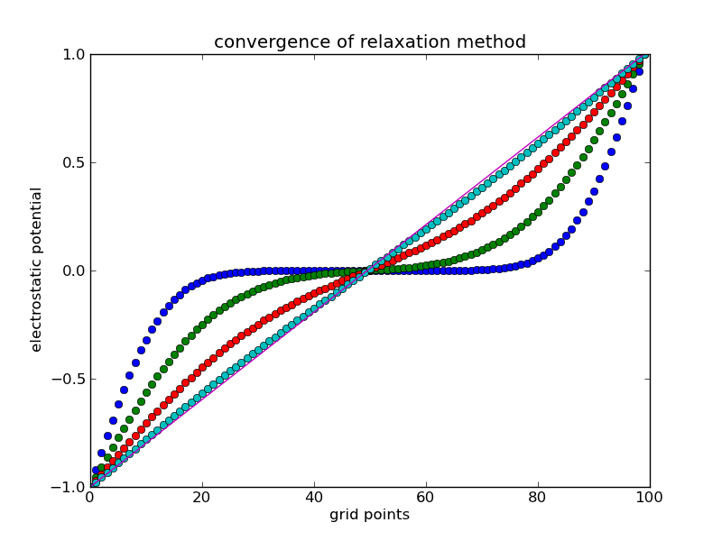

<section data-markdown>

The solution to Laplace's equation in one Cartesian dimension is always linear. Why?

1. The general solution for $\frac{d^2V(x)}{dx^2} = 0$ is always a line.
2. The only way for a given point $V(x_i)$ (in 1d) to be the arithmetic average of its neighbors is for all point to be on a line.
3. Given boundary conditions, it's a unique solution.
4. None of these.
5. More than one of these.

</section>

<section data-markdown>

### Method of Relaxation

</section>

<section data-markdown>

Consider a function $f(x)$ that is both continuous and continuously differentiable over some domain. Given a step size of $a$, which could be an approximate derivative of this function somewhere in that domain? $df/dx \approx$

1. $f(x_i+a) - f(x_i)$
2. $f(x_i) - f(x_i-a)$
3. $\frac{f(x_i+a) - f(x_i)}{a}$
4. $\frac{f(x_i) - f(x_i-a)}{a}$
5. More than one of these

Note:
* Correct Answer: E (C and D)
</section>

<section data-markdown>
If we choose to use:

$$\dfrac{df}{dx} \approx \dfrac{f(x_i+a) - f(x_i)}{a}$$

Where are we computing the approximate derivative?

1. $a$
2. $x_i$
3. $x_i + a$
4. Somewhere else

Note:
* Correct Answer: D (it's halfway between)

</section>

<section data-markdown>

Taking the second derivative of $f(x)$ discretely is as simple as applying the discrete definition of the derivative,

$$f''(x_i) \approx \dfrac{f'(x_i + a/2) - f'(x_i - a/2)}{a}$$

Derive the second derivative in terms of $f$.

</section>

<section data-markdown>

With the approximate form of Laplace's equation:

$\dfrac{V(x_i+a) - 2V(x_i) + V(x_i-a)}{a} \approx 0$

What is a the appropriate estimate of $V(x_i)$?

1. ${1}/{2}(V(x_i+a)-V(x_i-a))$
2. ${1}/{2}(V(x_i+a)+V(x_i-a))$
3. ${a}/{2}(V(x_i+a)-V(x_i-a))$
4. ${a}/{2}(V(x_i+a)+V(x_i-a))$
5. Something else

Note:
* Correct answer: B

</section>

<section data-markdown>

To investigate the convergence, we must compare the estimate of $V$ before and after each calculation. For our 1D relaxation code, $V$ will be a 1D array. For the kth estimate, we can compare $V_k$ against its previous value by simply taking the difference.

Store this in a variable called ``err``. What is the type for ``err``?

1. A single number
2. A 1D array
3. A 2D array
4. ???

Note:
* Correct Answer: B

</section>

<section data-markdown>

The Method of Relaxation also works for Poisson's equation (i.e., when there is charge!).

Given, $\nabla^2 V \approx \dfrac{V(x+a)-2V(x)+V(x-a)}{a^2}$

Which equations describes the appropriate "averaging" that we must do:

1. $V(x) = \dfrac{1}{2}(V(x+a)-V(x-a))$
2. $V(x) = \dfrac{\rho(x)}{\varepsilon_0}+\dfrac{1}{2}(V(x+a)+V(x-a))$
3. $V(x) = \dfrac{a^2\rho(x)}{2\varepsilon_0}+\dfrac{1}{2}(V(x+a)+V(x-a))$

Note:
* Correct answer: C

</section>

<section data-markdown>

### Separation of Variables (Cartesian)

</section>
