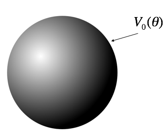

<section data-markdown>

How many boundary conditions (on the potential $V$) do you use to find $V$ inside the spherical plastic shell?

1. 1
2. 2
3. 3
4. 4
5. It depends on $V_0(\theta)$

Note:
* CORRECT ANSWER: B
* Good for discussion; obviously you need the surface BC, but what about at r=0? Is that technically a BC?
</section>

<section data-markdown>

</section>

<section data-markdown>

$$V(r,\theta) = \sum_{l=0}^{\infty} \left(A_l r^l + \dfrac{B_l}{r^{l+1}}\right)P_l(\cos \theta)$$

Suppose V on a spherical shell is:

$$V(R,\theta) = V_0 \left(1+\cos^2\theta\right)$$

Which terms do you expect to appear when finding **V(inside)**?
1. Many $A_l$ terms (but no $B_l$'s)
2. Many $B_l$ terms (but no $A_l$'s)
3. Just $A_0$ and $A_2$
4. Just $B_0$ and $B_2$
5. Something else!

Note:
* CORRECT ANSWER: C
* Avoid blowup and match cosine

</section>

<section data-markdown>

$$V(r,\theta) = \sum_{l=0}^{\infty} \left(A_l r^l + \dfrac{B_l}{r^{l+1}}\right)P_l(\cos \theta)$$

Suppose V on a spherical shell is:

$$V(R,\theta) = V_0 \left(1+\cos^2\theta\right)$$

Which terms do you expect to appear when finding **V(outside)**?
1. Many $A_l$ terms (but no $B_l$'s)
2. Many $B_l$ terms (but no $A_l$'s)
3. Just $A_0$ and $A_2$
4. Just $B_0$ and $B_2$
5. Something else!

Note:
* CORRECT ANSWER: D
* Avoid blowup and match cosine

</section>
