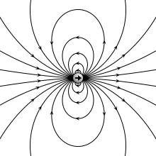

<section data-markdown>

Consider a solid sphere of charge that has a charge density that varies with $\cos \theta$. What can we say about the terms in the general solution to Laplace's equation outside there sphere?

$$V(r,\theta) = \sum_l\left(A_l\,r^l + \dfrac{B_l}{r^{(l+1)}}\right)P_l(\cos \theta)$$

1. All the $A_l$'s are zero
2. All the $B_l$'s are zero
3. Only $A_0$ should remain
4. Only $B_0$ should remain
5. Something else

Note: Correct answer E because B0 and B1 remain

</section>

<section data-markdown>

Two charges are positioned as shown to the left. The relative position vector between them is $\mathbf{d}$. What is the value of of the dipole moment? $\sum_i q_i \mathbf{r}_i$

1. $+q\mathbf{d}$
2. $-q\mathbf{d}$
3. Zero
4. None of these

Note:
* CORRECT ANSWER: A

</section>

<section data-markdown>

## Multipole Expansion

Multipole Expansion of the Power Spectrum of CMBR

Note: The radiation from cosmic microwave background can be described in terms of contributions using a basis of functions with increasing smaller contributions.

</section>

<section data-markdown>

Two charges are positioned as shown to the left. The relative position vector between them is $\mathbf{d}$. What is the dipole moment of this configuration?

$$\sum_i q_i \mathbf{r}_i$$

1. $+q\mathbf{d}$
2. $-q\mathbf{d}$
3. Zero
4. None of these; it's more complicated than before!

Note:
* CORRECT ANSWER: A

</section>

<section data-markdown>

For a dipole at the origin pointing in the z-direction, we have derived:

$$\mathbf{E}_{dip}(\mathbf{r}) = \dfrac{p}{4 \pi \varepsilon_0 r^3}\left(2 \cos \theta\;\hat{\mathbf{r}} + \sin \theta\;\hat{\mathbf{\theta}}\right)$$

For the dipole $\mathbf{p} = q\mathbf{d}$ shown, what does the formula predict for the direction of $\mathbf{E}(\mathbf{r}=0)$?

1. Down
2. Up
3. Some other direction
4. The formula doesn't apply

Note:
* CORRECT ANSWER: D
* The formula works far from the dipole only.

</section>

<section data-markdown>

### Ideal vs. Real dipole

</section>
