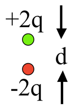
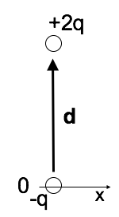
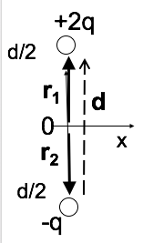

<section data-markdown>

**True or False**: The electric potential of a pure dipole is given exactly by:

$$V(r) = \dfrac{\mathbf{p}\cdot\mathbf{r}}{4 \pi\varepsilon_0 r^3}$$

1. True
2. False

</section>

<section data-markdown>

## Announcements

* Exam 2 is coming up (2 weeks from today)
  * BPS 1415 (this room), 7pm-9pm, Nov 7th
  * Same format as Exam 1
  * Details next week

</section>

<section data-markdown>

$$\mathbf{p} = \sum_i q_i \mathbf{r}_i$$

What is the magnitude of the dipole moment of this charge distribution?

1. qd
2. 2qd
3. 3qd
4. 4qd
5. It's not determined

Note:
* CORRECT ANSWER: B

</section>

<section data-markdown>

$$\mathbf{p} = \sum_i q_i \mathbf{r}_i$$

What is the dipole moment of this system?

(BTW, it is NOT overall neutral!)

1. $q\mathbf{d}$
2. $2q\mathbf{d}$
3. $\frac{3}{2}q\mathbf{d}$
4. $3q\mathbf{d}$
5. Someting else (or not defined)

Note:
* CORRECT ANSWER: B

</section>

<section data-markdown>

$$\mathbf{p} = \sum_i q_i \mathbf{r}_i$$

What is the dipole moment of this system?

(Same as last question, just shifted in $z$.)

1. $q\mathbf{d}$
2. $2q\mathbf{d}$
3. $\frac{3}{2}q\mathbf{d}$
4. $3q\mathbf{d}$
5. Someting else (or not defined)

Note:
* CORRECT ANSWER: C

</section>

<section data-markdown>

You have a physical dipole, $+q$ and $-q$ a finite distance $d$ apart. When can you use the expression:

$$V(\mathbf{r}) = \dfrac{1}{4 \pi \varepsilon_0}\dfrac{\mathbf{p}\cdot \hat{\mathbf{r}}}{r^2}$$

1. This is an exact expression everywhere.
2. It's valid for large $r$
3. It's valid for small $r$
4. No idea...

Note:
* CORRECT ANSWER: B

</section>

<section data-markdown>

You have a physical dipole, $+q$ and $-q$ a finite distance $d$ apart. When can you use the expression:

$$V(\mathbf{r}) = \dfrac{1}{4 \pi \varepsilon_0}\sum_i \dfrac{q_i}{\mathfrak{R}_i}$$

1. This is an exact expression everywhere.
2. It's valid for large $r$
3. It's valid for small $r$
4. No idea...

Note:
* CORRECT ANSWER: A

</section>
