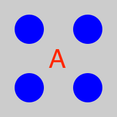

<section data-markdown>

Which charge distributions below produce a potential that looks like $\frac{C}{r^2}$ when you are far away?

E) None of these, or more than one of these!

(For any which you did not select, how DO they behave at large r?)

Note:
* CORRECT ANSWER: E (Both C and D)

</section>

<section data-markdown>

Which charge distributions below produce a potential that looks like $\frac{C}{r^2}$ when you are far away?

E) None of these, or more than one of these!

(For any which you did not select, how DO they behave at large r?)

Note:
* CORRECT ANSWER: E (Both B and D)

</section>

<section data-markdown>

In terms of the multipole expansion $V(r) = V(mono) + V(dip) + V(quad) + \dots$, the following charge distribution has the form:

1. $V(r) = V(mono) + V(dip) +\;$ higher order terms
2. $V(r) = V(dip) +\;$ higher order terms
3. $V(r) = V(dip)$
4. $V(r) =\;$ only higher order terms than dipole
5. No higher terms, $V(r) = 0$ for this one.

Note:
* CORRECT ANSWER: D

</section>

<section data-markdown>

Which of the following distributions could have a dipole contribution to the potential far from the charges?

D. None

E. More than one!

Note:
* CORRECT ANSWER: E
* We didn't specify where the origin!

</section>

<section data-markdown>

In which situation is the dipole term the leading non-zero contribution to the potential?

1. 1 and 3
2. 2 and 4
3. only 5
4. 1 and 5
5. Some other combo

Note:
* CORRECT ANSWER: D

</section>

<section data-markdown>

Consider a single point charge at the origin. It will have ONLY a monopole contribution to the potential at a location $\mathbf{r} = \langle x,y,z\rangle$.

As we have seen, if we move the charge to another location (e.g., $\mathbf{r}' = \langle 0,0,d \rangle$), the distribution now has a dipole contribution to the potential at $\mathbf{r}$!

What the hell is going on here?

1. It's just how the math works out. Nothing has changed physically at $\mathbf{r}$.
2. There is something different about the field at $\mathbf{r}$ and the potential is showing us that.
3. I'm not sure how to resolve this problem.

</section>

<section data-markdown>

## Polarization

</section>

<section data-markdown>

A stationary point charge $+Q$ is near a block of polarization material (a linear dielectric).  The net electrostatic force on the block due to the point charge is:

1. attractive (to the left)
2. repulsive (to the right)
3. zero

Note:
* CORRECT ANSWER: A

</section>

<section data-markdown>

The sphere below (radius $a$) has uniform polarization $\mathbf{P}_0$, which points in the $+z$ direction.
What is the total dipole moment of this sphere?

1. zero
2. $\mathbf{P}_0 a^3$
3. $4\pi a^3 \mathbf{P}_0/3$
4. $\mathbf{P}_0$
5. None of these/must be more complicated

Note:
* CORRECT ANSWER: C

</section>

<section data-markdown>

The cube below (side $a$) has uniform polarization $\mathbf{P}_0$, which points in the $+z$ direction.
What is the total dipole moment of this cube?

1. zero
2. $a^3 \mathbf{P}_0$
3. $\mathbf{P}_0$
4. $\mathbf{P}_0/a^3$
5. $2 \mathbf{P}_0 a^2$

Note:
* CORRECT ANSWER: B

</section>
