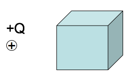
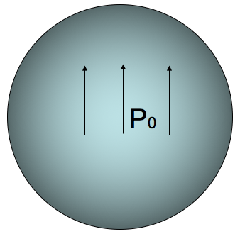
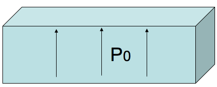

<section data-markdown>

A stationary point charge $+Q$ is near a block of polarization material (a linear dielectric).  The net electrostatic force on the block due to the point charge is:

1. attractive (to the left)
2. repulsive (to the right)
3. zero

Note:
* CORRECT ANSWER: A

</section>

<section data-markdown>

## Exam 2 Information

* Covers through polarization (up to Ch 4.2.3)
* Emphasizes material since Exam 1
  * But don't forget Exam 1 material!
* Specifics on Wednesday

</section>

<section data-markdown>

## Polarization

</section>

<section data-markdown>

The sphere below (radius $a$) has uniform polarization $\mathbf{P}_0$, which points in the $+z$ direction.
What is the total dipole moment of this sphere?

1. zero
2. $\mathbf{P}_0 a^3$
3. $4\pi a^3 \mathbf{P}_0/3$
4. $\mathbf{P}_0$
5. None of these/must be more complicated

Note:
* CORRECT ANSWER: C

</section>

<section data-markdown>

The cube below (side $a$) has uniform polarization $\mathbf{P}_0$, which points in the $+z$ direction.
What is the total dipole moment of this cube?

1. zero
2. $a^3 \mathbf{P}_0$
3. $\mathbf{P}_0$
4. $\mathbf{P}_0/a^3$
5. $2 \mathbf{P}_0 a^2$

Note:
* CORRECT ANSWER: B

</section>

<section data-markdown>

Consider a cylinder of radius $a$ and height $b$ that has it base at the origin and is aligned along the $z$-axis. The polarization of this cylinder is "baked in" and can be modeled using

$$\mathbf{P} = P_0 \left(\dfrac{z}{b}\right)\hat{z}.$$

Determine the total dipole moment of this cylinder:

1. $P_0 \pi a^2 b \hat{z}$
2. $\frac{1}{2} P_0 \pi a^2 b \hat{z}$
3. $P_0 2 \pi a b^2 \hat{z}$
4. $\frac{1}{2}P_0 \pi a b^2 \hat{z}$
5. Something else

Note:
* Correct answer: B take the integral

</section>

<section data-markdown>

In the following case, is the bound surface and volume charge zero or nonzero?

1. $\sigma_b = 0, \rho_b \neq 0$
2. $\sigma_b \neq 0, \rho_b \neq 0$
3. $\sigma_b = 0, \rho_b=0$
4. $\sigma_b \neq 0, \rho_b=0$

Note:
* CORRECT ANSWER:  D

</section>

<section data-markdown>

In the following case, is the bound surface and volume charge zero or nonzero?

1. $\sigma_b = 0, \rho_b \neq 0$
2. $\sigma_b \neq 0, \rho_b \neq 0$
3. $\sigma_b = 0, \rho_b=0$
4. $\sigma_b \neq 0, \rho_b=0$

Note:
* CORRECT ANSWER:  B

</section>

<section data-markdown>

A VERY thin slab of thickness $d$ and area $A$ has volume charge density $\rho = Q / V$. Because it's so thin, we may think of it as a surface charge density $\sigma = Q / A$.

The relation between $\rho$ and $\sigma$ is:
1. $\sigma = \rho$
2. $\sigma = \rho d$
3. $\sigma = \rho/d$
4. $\sigma = V \rho$
5. $\sigma = \rho/V$

Note:
* CORRECT ANSWER: B

</section>

<section data-markdown>

A dielectric slab (top area $A$, height $h$) has been polarized, with $\mathbf{P}=P_0$ in the $+z$ direction. What is the surface charge density, $\sigma_b$, on the bottom surface?

1. 0
2. $-P_0$
3. $P_0$
4. $P_0 A h$
5. $P_0 A$

Note:
* CORRECT ANSWER: B

</section>

<section data-markdown>

A dielectric sphere is uniformly polarized,

$$\mathbf{P} = +P_0\hat{z}$$

What is the surface charge density?

1. 0
2. Non-zero Constant
3. constant*$\sin \theta$
4. constant*$\cos \theta$
5.  ??

Note:
* CORRECT ANSWER: D

</section>
