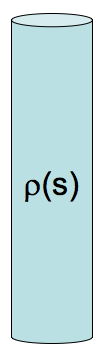

<section data-markdown>

Are $\rho_b$ and $\sigma_b$ due to real charges?

1. Of course not! They are as fictitious as it gets!
2. Of course they are!  They are as real as it gets!
3. I have no idea

Note:
* CORRECT ANSWER: B
</section>

<section data-markdown>

## Announcements

* Exam 2 (Wednesday, November 7th 7-9pm)
* Covers through Homework 9 (solutions posted after class)
* "Comprehensive" exam (need to remember old stuff)
* 1 sheet of your own notes; old exam and formula sheet will be posted

</section>

<section data-markdown>

## What's on Exam 2?

* Using Legendre polynomials and separation of variables in spherical coordinates, solve for the potential and distribution of charge in a boundary value problem
* Using the multipole expansion, find the approximate form of the potential for a distribution of charge
* Determine the bound charge in a material with a given polarization
* Find the electric potential for a 1D Laplace problem and explain how you would determine it using the method of relaxation
* (BONUS) Solve a 3D Laplace problem

</section>

<section data-markdown>

If you put a polarizable material (a dielectric) in an external field $\mathbf{E}_e$, it polarizes, adding a new field, $\mathbf{E}_p$
(from the bound charges). These superpose, making a total field, $\mathbf{E}_T$.  What is the vector equation relating these three fields?

1. $\mathbf{E}_T + \mathbf{E}_e + \mathbf{E}_p = 0$
2. $\mathbf{E}_T = \mathbf{E}_e - \mathbf{E}_p$
3. $\mathbf{E}_T = \mathbf{E}_e + \mathbf{E}_p$
4. $\mathbf{E}_T = -\mathbf{E}_e + \mathbf{E}_p$
5. Something else

Note:
* CORRECT ANSWER: C
</section>

<section data-markdown>

A solid non-conducting dielectric rod has been injected ("doped") with a fixed, known charge distribution $\rho(s)$. (The material responds, polarizing internally.)

When computing $D$ in the rod, do you treat this $\rho(s)$ as the "free charges" or "bound charges"?

1. "free charge"
2. "bound charge"
3. Neither of these - $\rho(s)$ is some combination of free and bound
4. Something else.

Note:
* CORRECT ANSWER: A

</section>
