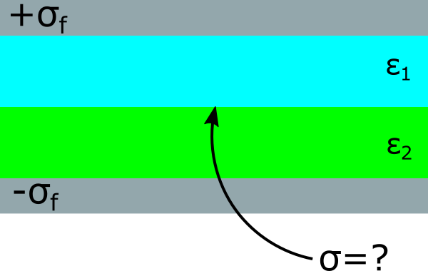

<section data-markdown>

A point charge $+q$ is placed at the center of a neutral, linear, homogeneous, dielectric teflon shell. Can $\mathbf{D}$ be computed from its divergence?

$$\oint \mathbf{D} \cdot d\mathbf{A} = Q_{free}$$

1. Yes
2. No
3. Depends on other things not given

</section>

<section data-markdown>

A point charge $+q$ is placed at the center of a neutral, linear, homogeneous, dielectric **hemispherical** shell. Can $\mathbf{D}$ be computed from its divergence?

$$\oint \mathbf{D} \cdot d\mathbf{A} = Q_{free}$$

1. Yes
2. No
3. Depends on other things not given

</section>

<section data-markdown>

## Boundary Conditions

</section>

<section data-markdown>

## Why are these boundary conditions useful?

</section>
