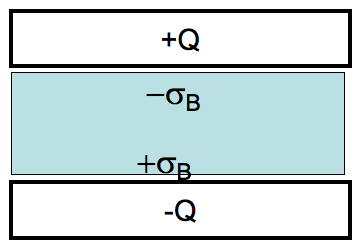

<section data-markdown>

An  ideal (large) capacitor has charge $Q$. A neutral linear dielectric is inserted into the gap. We want to find $\mathbf{D}$ in the dielectric.

$$\oint \mathbf{D}\cdot d\mathbf{A} = Q_{free}$$

What is $|\mathbf{D}|$ in the dielectric?

1. $\sigma$
2. $2\sigma$
3. $\sigma/2$
4. $\sigma+\sigma_b$
5. Something else

Note:
* CORRECT ANSWER: A

</section>

<section data-markdown>

An ideal (large) capacitor has charge $Q$. A neutral linear dielectric is inserted into the gap. Now that we have $\mathbf{D}$ in the dielectric, what is $\mathbf{E}$ inside the dielectric?

1. $\mathbf{E} = \mathbf{D} \varepsilon_0 \varepsilon_r$
2. $\mathbf{E} = \mathbf{D}/\varepsilon_0 \varepsilon_r$
3. $\mathbf{E} = \mathbf{D} \varepsilon_0$
4. $\mathbf{E} = \mathbf{D}/\varepsilon_0$
5. Not so simple! Need another method

Note:
* CORRECT ANSWER: B

</section>

<section data-markdown>

A point charge $+q$ is placed at the center of a neutral, linear, homogeneous, dielectric teflon shell. Can $\mathbf{D}$ be computed from its divergence?

$$\oint \mathbf{D} \cdot d\mathbf{A} = Q_{free}$$

1. Yes
2. No
3. Depends on other things not given

</section>

<section data-markdown>

A point charge $+q$ is placed at the center of a neutral, linear, homogeneous, dielectric **hemispherical** shell. Can $\mathbf{D}$ be computed from its divergence?

$$\oint \mathbf{D} \cdot d\mathbf{A} = Q_{free}$$

1. Yes
2. No
3. Depends on other things not given

</section>

<section data-markdown>

## Boundary Conditions

</section>

<section data-markdown>

## Why are these boundary conditions useful?

</section>
