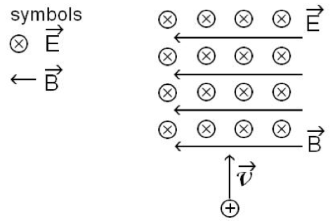

<section data-markdown>

A negative charge ($-q$) is moving in the $+x$ direction when it encounters a region of constant magnetic field pointing in the $-y$ direction. Which is the direction of the initial net force on the charge?

1. $+y$
2. $-y$
3. $+z$
4. $-z$
5. ???

Note:
* CORRECT ANSWER: C
* Make sure to take into account the sign change
</section>

<section data-markdown>

In the boundary condition for $E_{\perp}$, the difference across the boundary is $\dfrac{\sigma}{\varepsilon_0}.$ What does that $\sigma$ contain?

1. Just $\sigma_{f}$
2. Just $\sigma_{b}$
3. Both
4. Something else

Note: Correct answer C

</section>

<section data-markdown>

Let's assume the normal vector at the material boundary points upward.

What the sign of the dot product of the electric field and this normal vector above and below the boundary (i.e., $\mathbf{E}\cdot\mathbf{n}$)?

1. Above is positive; below is negative
2. Above is negative; below is negative
3. Above is negative; below is positive
4. Above is positive; below is positive

Note: Correct answer B

</section>

<section data-markdown>

## Magnetostatics

</section>

<section data-markdown>

A proton ($q=+e$) is released from rest in a uniform $\mathbf{E}$ and uniform $\mathbf{B}$.  $\mathbf{E}$ points up, $\mathbf{B}$ points into the page.  Which of the paths will the proton initially follow?

Note:
* CORRECT ANSWER: C
</section>

<section data-markdown>

A + charged particle moving up (speed $v$) enters a region with uniform $\mathbf{B}$ (left) and uniform $\mathbf{E}$ (into page). What's the direction of $\mathbf{F}_{net}$ on the particle, at the instant it enters the region?

1. To the left
2. Into the page
3. Out of the page
4. No net force
5. Not enough information

Note:
* CORRECT ANSWER: E
* The forces point in opposite directions, but not sure of their size
</section>
