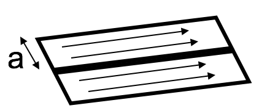

<section data-markdown>

Positive ions flow right through a liquid, negative ions flow left. The spatial density and speed of both ions types are identical. Is there a net current through the liquid?

1. Yes, to the right
2. Yes, to the left
3. No
4. Not enough information given

Note:
* CORRECT ANSWER: A

</section>

<section data-markdown>

Current $I$ flows down a wire (length $L$) with a square cross section (side $a$). If it is uniformly distributed over the entire wire area, what is the magnitude of the volume current density $J$?

1. $J = I/a^2$
2. $J = I/a$
3. $J = I/4a$
4. $J = a^2I$
5. None of the above

Note:
* CORRECT ANSWER: A

</section>

<section data-markdown>

We defined the volume current density in terms of the differential, $\mathbf{J} \equiv \dfrac{d\mathbf{I}}{da_{\perp}}$.

When is it ok to determine the volume current density by taking the ratio of current to cross-sectional area?
$$\mathbf{J} \stackrel{?}{=} \dfrac{\mathbf{I}}{A}$$

1. Never
2. Always
3. $I$ is uniform
4. $I$ is uniform and $A$ is $\perp$ to $I$
5. None of these

Note:
* CORRECT ANSWER: D

</section>

<section data-markdown>

Current $I$ flows down a wire (length $L$) with a square cross section (side $a$). If it is uniformly distributed over the outer surfaces only, what is the magnitude of the surface current density $K$?

1. $K = I/a^2$
2. $K = I/a$
3. $K = I/4a$
4. $K = aI$
5. None of the above

Note:
* CORRECT ANSWER: C

</section>

<section data-markdown>

A "ribbon" (width $a$) of surface current flows (with surface current density $K$). Right next to it is a second identical ribbon of current. Viewed collectively, what is the new total surface current density?

1. $K$
2. $2K$
3. $K/2$
4. Something else

Note:
* CORRECT ANSWER: A

</section>

<section data-markdown>

Which of the following is a statement of charge conservation?

1. $\dfrac{\partial \rho}{\partial t} = -\nabla \mathbf{J}$
2. $\dfrac{\partial \rho}{\partial t} = -\nabla \cdot \mathbf{J}$
3. $\dfrac{\partial \rho}{\partial t} = -\int \nabla \cdot \mathbf{J} d\tau$
4. $\dfrac{\partial \rho}{\partial t} = -\oint \mathbf{J} \cdot d\mathbf{A}$

Note:
* CORRECT ANSWER: B

</section>

<section data-markdown>

To find the magnetic field $\mathbf{B}$ at P due to a current-carrying wire we use the Biot-Savart law,
$$\mathbf{B}(\mathbf{r})  = \dfrac{\mu_0}{4\pi}I\int \dfrac{d\mathbf{l}\times\hat{\mathfrak{R}}}{\mathfrak{R}^2}$$
In the figure, with $d\mathbf{l}$ shown, which purple vector best represents $\mathfrak{R}$?

Note:
* CORRECT ANSWER: A

</section>
