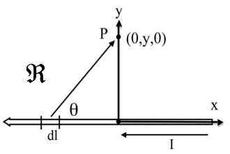

<section data-markdown>

A "ribbon" (width $a$) with uniform surface current density $K$ passes through a uniform magnetic field $\mathbf{B}_{ext}$. Only the length $b$ along the ribbon is in the field. What is the magnitude of the force on the ribbon?

1. $KB$
2. $aKB$
3. $abKB$
4. $bKB/a$
5. $KB/(ab)$

Note:
* CORRECT ANSWER: C

</section>

<section data-markdown>

To find the magnetic field $\mathbf{B}$ at P due to a current-carrying wire we use the Biot-Savart law,
$$\mathbf{B}(\mathbf{r})  = \dfrac{\mu_0}{4\pi}I\int \dfrac{d\mathbf{l}\times\hat{\mathfrak{R}}}{\mathfrak{R}^2}$$
In the figure, with $d\mathbf{l}$ shown, which purple vector best represents $\mathfrak{R}$?

Note:
* CORRECT ANSWER: A

</section>

<section data-markdown>

To find the magnetic field $\mathbf{B}$ at P due to a current-carrying wire we use the Biot-Savart law,
$$\mathbf{B}(\mathbf{r})  = \dfrac{\mu_0}{4\pi}I\int \dfrac{d\mathbf{l}\times\hat{\mathfrak{R}}}{\mathfrak{R}^2}$$
What is the direction of the infinitesimal contribution $\mathbf{B}(P)$ created by current in $d\mathbf{l}$?

1. Up the page
2. Directly away from $d\mathbf{l}$ (in the plane of the page)
3. Into the page
4. Out of the page
5. Some other direction

Note:
* CORRECT ANSWER: C

</section>

<section data-markdown>

What is the magnitude of $\dfrac{d\mathbf{l}\times\hat{\mathfrak{R}}}{\mathfrak{R}^2}$?

1. $\frac{dl \sin\theta}{\mathfrak{R}^2}$
2. $\frac{dl \sin\theta}{\mathfrak{R}^3}$
3. $\frac{dl \cos\theta}{\mathfrak{R}^2}$
4. $\frac{dl \cos\theta}{\mathfrak{R}^3}$
5. something else!

Note:
* CORRECT ANSWER: A

</section>

<section data-markdown>

What is the value of $I \dfrac{d\mathbf{l} \times \hat{\mathfrak{R}}}{\mathfrak{R}^2}$?

1. $\frac{I\,y\,dx'}{[(x')^2+y^2]^{3/2}}\hat{z}$
2. $\frac{I\,x'\,dx'}{[(x')^2+y^2]^{3/2}}\hat{y}$
3. $\frac{-I\,x'\,dx'}{[(x')^2+y^2]^{3/2}}\hat{y}$
4. $\frac{-I\,y\,dx'}{[(x')^2+y^2]^{3/2}}\hat{z}$
5. Other!

Note:
* CORRECT ANSWER: D

</section>

<section data-markdown>

What do you expect for direction of $\mathbf{B}(P)$? How about direction of $d\mathbf{B}(P)$ generated JUST by the segment of current $d\mathbf{l}$ in red?

1. $\mathbf{B}(P)$ in plane of page,  ditto for $d\mathbf{B}(P$, by red$)$
2. $\mathbf{B}(P)$ into page,  $d\mathbf{B}(P$, by red$)$ into page
3. $\mathbf{B}(P)$ into page,  $d\mathbf{B}(P$, by red$)$ out of page
4. $\mathbf{B}(P)$ complicated, ditto for $d\mathbf{B}(P$, by red$)$
5. Something else!!

Note:
* CORRECT ANSWER: C
</section>
