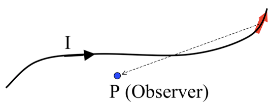

<section data-markdown>

What do you expect for direction of $\mathbf{B}(P)$? How about direction of $d\mathbf{B}(P)$ generated JUST by the segment of current $d\mathbf{l}$ in red?

1. $\mathbf{B}(P)$ in plane of page,  ditto for $d\mathbf{B}(P$, by red$)$
2. $\mathbf{B}(P)$ into page,  $d\mathbf{B}(P$, by red$)$ into page
3. $\mathbf{B}(P)$ into page,  $d\mathbf{B}(P$, by red$)$ out of page
4. $\mathbf{B}(P)$ complicated, ditto for $d\mathbf{B}(P$, by red$)$
5. Something else!!

Note:
* CORRECT ANSWER: C
</section>

<section data-markdown>

I have two very long, parallel wires each carrying a current $I_1$ and $I_2$, respectively.  In which direction is the force on the wire with the current $I_2$?

 1. Up
 2. Down
 3. Right
 4. Left
 5. Into or out of the page

 Note:
 * CORRECT ANSWER: D

</section>

<section data-markdown>

What is the magnitude of $\dfrac{d\mathbf{l}\times\hat{\mathfrak{R}}}{\mathfrak{R}^2}$?

1. $\frac{dl \sin\phi}{z^2}$
2. $\frac{dl}{z^2}$
3. $\frac{dl \sin\phi}{z^2+a^2}$
4. $\frac{dl}{z^2+a^2}$
5. something else!

Note:
* CORRECT ANSWER: D

</section>

<section data-markdown>
What is $d\mathbf{B}_z$ (the contribution to the vertical component of $\mathbf{B}$ from this $d\mathbf{l}$ segment?)

1. $\frac{dl}{z^2+a^2}\frac{a}{\sqrt{z^2+a^2}}$
1. $\frac{dl}{z^2+a^2}$
1. $\frac{dl}{z^2+a^2}\frac{z}{\sqrt{z^2+a^2}}$
1. $\frac{dl \cos \phi}{\sqrt{z^2+a^2}}$
5. Something else!

Note:
* CORRECT ANSWER: A

</section>

<section data-markdown>

What is $\oint \mathbf{B}\cdot d\mathbf{l}$ around this purple (dashed) Amperian loop?

1. $\mu_0 (|I_2 | +|I_1 |)$
2. $\mu_0 (|I_2|-|I_1|)$
3. $\mu_0 (| I_2 | + | I_1 | \sin \theta)$
4. $\mu_0 (| I_2 | - | I_1 | \sin \theta)$
5. $\mu_0 (| I_2 | + | I_1 | \cos\theta)$

Note:
* CORRECT ANSWER: A

</section>

<section data-markdown>

Stoke's Theorem says that for a surface $S$ bounded by a perimeter $L$, any vector field $\mathbf{B}$ obeys:

$$\int_S (\nabla \times \mathbf{B}) \cdot dA = \oint_L \mathbf{B} \cdot d\mathbf{l}$$

Does Stoke's Theorem apply for any surface $S$ bounded by a perimeter $L$, even this balloon-shaped surface $S$?

1. Yes
2. No
3. Sometimes

Note:
* CORRECT ANSWER: A

</section>

<section data-markdown>

Rank order $\int \mathbf{J} \cdot d\mathbf{A}$ (over blue surfaces) where $\mathbf{J}$ is uniform, going left to right:

1. iii > iv > ii > i
2. iii > i > ii > iv
3. i > ii > iii > iv
4. Something else!!
5. Not enough info given!!

Note:
* CORRECT ANSWER: D
* They are all the same!

</section>

<section data-markdown>

Much like Gauss's Law, Ampere's Law is always true (for magnetostatics), but only useful when there's sufficient symmetry to "pull B out" of the integral.

So we need to build an argument for what $\mathbf{B}$ looks like and what it can depend on.

For the case of an infinitely long wire, can $\mathbf{B}$ point radially (i.e., in the $\hat{s}$ direction)?

1. Yes
2. No
3. ???

Note:
* CORRECT ANSWER: B
* It violates Gauss's Law for B

</section>

<section data-markdown>

Continuing to build an argument for what $\mathbf{B}$ looks like and what it can depend on.

For the case of an infinitely long wire, can $\mathbf{B}$ depend on $z$ or $\phi$?

1. Yes
2. No
3. ???

Note:
* CORRECT ANSWER: B
* By symmetry it cannot

</section>

<section data-markdown>

Finalizing the argument for what $\mathbf{B}$ looks like and what it can depend on.

For the case of an infinitely long wire, can $\mathbf{B}$ have a $\hat{z}$ component?

1. Yes
2. No
3. ???

Note:
* CORRECT ANSWER: B
* Biot-Savart suggests it cannot

</section>

<section data-markdown>

For the infinite wire, we argued that $\mathbf{B}(\mathbf{r}) = B(s)\hat{\phi}$. For the case of an infinitely long **thick** wire of radius $a$, is this functional form still correct? Inside and outside the wire?

1. Yes
2. Only inside the wire ($s<a$)
3. Only outside the wire ($s>a$)
4. No

Note:
* CORRECT ANSWER: A

</section>
