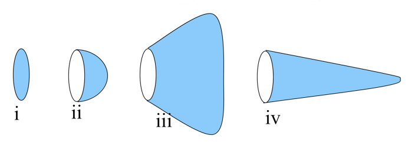
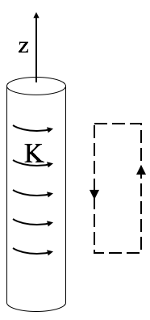

<section data-markdown>

Rank order $\int \mathbf{J} \cdot d\mathbf{A}$ (over blue surfaces) where $\mathbf{J}$ is uniform, going left to right:

1. iii > iv > ii > i
2. iii > i > ii > iv
3. i > ii > iii > iv
4. Something else!!
5. Not enough info given!!

Note:
* CORRECT ANSWER: D
* They are all the same!

</section>

<section data-markdown>

Much like Gauss's Law, Ampere's Law is always true (for magnetostatics), but only useful when there's sufficient symmetry to "pull B out" of the integral.

So we need to build an argument for what $\mathbf{B}$ looks like and what it can depend on.

For the case of an infinitely long wire, can $\mathbf{B}$ point radially (i.e., in the $\hat{s}$ direction)?

1. Yes
2. No
3. ???

Note:
* CORRECT ANSWER: B
* It violates Gauss's Law for B

</section>

<section data-markdown>

Continuing to build an argument for what $\mathbf{B}$ looks like and what it can depend on.

For the case of an infinitely long wire, can $\mathbf{B}$ depend on $z$ or $\phi$?

1. Yes
2. No
3. ???

Note:
* CORRECT ANSWER: B
* By symmetry it cannot

</section>

<section data-markdown>

Finalizing the argument for what $\mathbf{B}$ looks like and what it can depend on.

For the case of an infinitely long wire, can $\mathbf{B}$ have a $\hat{z}$ component?

1. Yes
2. No
3. ???

Note:
* CORRECT ANSWER: B
* Biot-Savart suggests it cannot

</section>

<section data-markdown>

For the infinite wire, we argued that $\mathbf{B}(\mathbf{r}) = B(s)\hat{\phi}$. For the case of an infinitely long **thick** wire of radius $a$, is this functional form still correct? Inside and outside the wire?

1. Yes
2. Only inside the wire ($s<a$)
3. Only outside the wire ($s>a$)
4. No

Note:
* CORRECT ANSWER: A

</section>

<section data-markdown>

Consider the B-field a distance z from a current sheet (flowing in the +x-direction) in the z = 0 plane. The B-field has:

1. y-component only
2. z-component only
3. y and z-components
4. x, y, and z-components
5. Other

Note:
* CORRECT ANSWER: A

</section>

<section data-markdown>

An infinite solenoid with surface current density $K$ is oriented along the $z$-axis. To use Ampere's Law, we need to argue what we think $\mathbf{B}(\mathbf{r})$ depends on and which way it points.

For this solenoid, $\mathbf{B}(\mathbf{r})=$

1. $B(z)\,\hat{z}$
2. $B(z)\,\hat{\phi}$
3. $B(s)\,\hat{z}$
4. $B(s)\,\hat{\phi}$
5. Something else?
</section>

<section data-markdown>

An infinite solenoid with surface current density $K$ is oriented along the $z$-axis. Apply Ampere's Law to the rectangular imaginary loop in the $yz$ plane shown.  What does this tell you about $B_z$, the $z$-component of the B-field outside the solenoid?

1. $B_z$ is constant outside
2. $B_z$ is zero outside
3. $B_z$ is not constant outside
4. It tells you nothing about $B_z$

Note:
* CORRECT ANSWER: A

</section>

<section data-markdown>

An infinite solenoid with surface current density $K$ is oriented along the $z$-axis. Apply Ampere's Law to the rectangular imaginary loop in the $yz$ plane shown. We can safely assume that $B(s\rightarrow\infty)=0$. What does this tell you about the B-field outside the solenoid?

1. $|\mathbf{B}|$ is a small non-zero constant outside
2. $|\mathbf{B}|$ is zero outside
3. $|\mathbf{B}|$ is not constant outside
4. We still don't know anything about $|\mathbf{B}|$

Note:
* CORRECT ANSWER: B

</section>

<section data-markdown>

What do we expect $\mathbf{B}(\mathbf{r})$ to look like for the infinite sheet of current shown below?

1. $B(x)\hat{x}$
2. $B(z)\hat{x}$
3. $B(x)\hat{z}$
4. $B(z)\hat{z}$
5. Something else

Note:
* CORRECT ANSWER: C

</section>

<section data-markdown>

Which Amperian loop are useful to learn about $B(x,y,z)$ somewhere?

E. More than 1

Note:
* CORRECT ANSWER: E
* Both B and A are useful!

</section>
