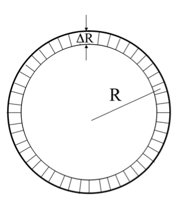

<section data-markdown>

Consider a toroid, which is like a finite solenoid connected end to end. In which direction do you expect the B field to point?

1. Azimuthally ($\hat{\phi}$ direction)
2. Radially ($\hat{s}$ direction)
3. In the $\hat{z}$ direction  (perp. to page)
4. Loops around the rim
5. Mix of the above...

Note:
* CORRECT ANSWER: A

</section>

<section data-markdown>

Which Amperian loop would you draw to find B “inside” the Torus (region II)?

1. Large "azimuthal" loop
2. Smallish loop from region II to outside (where B=0)
3. Small loop in region II
4. Like A, but perp to page
5. Something entirely different

Note:
* CORRECT ANSWER: A

</section>

<section data-markdown>

Gauss' Law for magnetism, $\nabla \cdot \mathbf{B} = 0$ suggests we can generate a potential for $\mathbf{B}$. What form should the definition of this potential take ($\Phi$ and $\mathbf{A}$ are placeholder scalar and vector functions, respectively)?

1. $\mathbf{B} = \nabla \Phi$
2. $\mathbf{B} = \nabla \times \Phi$
3. $\mathbf{B} = \nabla \cdot \mathbf{A}$
4. $\mathbf{B} = \nabla \times \mathbf{A}$
5. Something else?!

Note:
* CORRECT ANSWER: D
</section>

<section data-markdown>

With $\nabla^2 \mathbf{A} = -\mu_0 \mathbf{J}$, we can write (in Cartesian coordinates):

$$\nabla^2 A_x = -\mu_0 J_x$$

Does that also mean in spherical coordinates that $\nabla^2 A_r = -\mu_0 J_r$?

1. Yes
2. No

Note:
* CORRECT ANSWER: B

</section>

<section data-markdown>

We can compute $\mathbf{A}$ using the following integral:

$\mathbf{A}(\mathbf{r}) = \dfrac{\mu_0}{4\pi}\int \dfrac{\mathbf{J}(\mathbf{r}')}{\mathfrak{R}}d\tau'$

Can you calculate that integral using spherical coordinates?

1. Yes, no problem
2. Yes, $r'$ can be in spherical, but $\mathbf{J}$ still needs to be in Cartesian components
3. No.

Note:
* CORRECT ANSWER: B
* It's subtle. Griffiths discusses this in a footnote, you can't solve for, say, the phi component of A by integrating the "phi component" of J (because the unit vectors in spherical coordinates themselves depend on position, and get differentiated by del squared too)

</section>

<section data-markdown>

For a infinite solenoid of radius $R$, with current $I$, and $n$ turns per unit length, which is the current density $\mathbf{J}$?

1. $\mathbf{J} = nI\hat{\phi}$
2. $\mathbf{J} = nI\delta(r-R)\hat{\phi}$
3. $\mathbf{J} = \frac{I}{n}\delta(r-R)\hat{\phi}$
4. $\mathbf{J} = \mu_0 nI\delta(r-R)\hat{\phi}$
5. Something else?!

Note:
* CORRECT ANSWER: B

</section>
