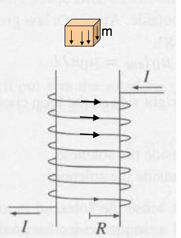
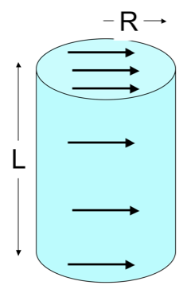
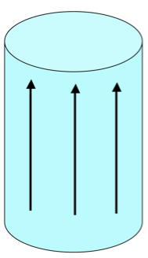
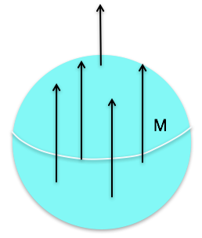

<section data-markdown>

The force on a segment of wire $L$ is $\mathbf{F} = I \mathbf{L} \times \mathbf{B}$ A current-carrying wire loop is in a constant magnetic field $\mathbf{B} = B \hat{z}$ as shown. What is the direction of the torque on the loop?

1. Zero
2. +x
3. +y
4. +z
5. None of these

Note:
* CORRECT ANSWER: B
</section>

<section data-markdown>
## Announcements

* Final Exam!
  * 12:45-2:45pm, Tues Dec. 11
  * In this room (1415 BPS)

</section>

<section data-markdown>
## What's on the final exam?

* A few true/false questions conceptual questions.
* Determine bound charge, $\mathbf{E}$, $\mathbf{D}$, $\mathbf{P}$ for some material with $\chi_e$, and explain where the bound charge is.
* Setup magnetic vector potential and field calculations. Compare the appraoches.
* Determine the $\mathbf{B}$ for some $\mathbf{J}$ using Ampere's Law.
* (BONUS) Determine bound currents, $\mathbf{B}$, and $\mathbf{H}$ for some material with a "simple" free current, and explain properties of the bound currents

</section>

<section data-markdown>

The torque on a magnetic dipole in a B field is:

$\mathbf{\tau} = \mathbf{m} \times \mathbf{B}$

How will a small current loop line up if the B field points uniformly up the page?

</section>

<section data-markdown>

Consider a paramagnetic material placed in a uniform external magnetic field, $\mathbf{B}_{ext}$. The paramagnetic magnetizes, so that the total magnetic field just outside the material is now...

1. smaller than
2. larger than
3. the same as

it was before the material was placed.

Note:
* Correct Answer: B

</section>

<section data-markdown>

In our model of diamagnetism, the electron (charge, $-e$) travels around the "loop" in a time,

$$T = \dfrac{2 \pi R}{v}.$$

What is the magnitude of magnetic dipole moment of this arrangement?

1. $evR$
2. $\dfrac{evR}{2}$
3. ${evR^2}$
4. $\dfrac{evR^2}{2}$
5. Something else?

Note:
* Correct Answer: B
</section>

<section data-markdown>

In our model of diamagnetism, let the angular momentum associated with the orbiting electron point in the $+z$ direction.

What is the direction of the magnetic moment?

1. Also $+z$
2. $-z$
3. It depends

Note:
* Correct Answer: B
</section>

<section data-markdown>

The torque on a magnetic dipole in a B field is:

$\mathbf{\tau} = \mathbf{m} \times \mathbf{B}$

How will a small current loop line up if the B field points uniformly up the page?

</section>

<section data-markdown>

A small chunk of material (the “tan cube”) is placed above a solenoid. It magnetizes, weakly, as shown by small arrows inside.
What kind of material must the cube be?

1. Dielectric
2. Conductor
3. Diamagnetic
4. Paramagnetic
5. Ferromagnetic

Note:
* CORRECT ANSWER: C

</section>

<section data-markdown>

A solid cylinder has uniform magnetization $\mathbf{M}$ throughout the volume in the $x$ direction as shown. What's the magnitude of the total magnetic dipole moment of the cylinder?

1. $\pi R^2 L M$
2. $2\pi R L M$
3. $2\pi R M$
4. $\pi R^2M$
5. Something else/it's complicated!

Note:
* CORRECT ANSWER: A

</section>

<section data-markdown>

A solid cylinder has uniform magnetization $\mathbf{M}$ throughout the volume in the $z$ direction as shown. Where do bound currents show up?

1. Everywhere
2. Volume only, not surface
3. Top/bottom surface only
4. Side (rounded) surface only
5. All surfaces, but not volume

Note:
* CORRECT ANSWER: D

</section>

<section data-markdown>

A solid cylinder has uniform magnetization $\mathbf{M}$ throughout the volume in the $x$ direction as shown. Where do bound currents show up?

1. Top/bottom surface only
2. Side (rounded) surface only
3. Everywhere
4. Top/bottom, and parts of (but not all of) side surface (but not in the volume)
5. Something different/other combination!

Note:
* CORRECT ANSWER: D

</section>

<section data-markdown>

A sphere has uniform magnetization $\mathbf{M}$ in the $+z$ direction. Which formula is correct for this surface current?

1. $M \sin \theta\,\hat{\theta}$
2. $M \sin \theta\,\hat{\phi}$
3. $M \cos \phi\,\hat{\theta}$
4. $M \cos \phi\,\hat{\phi}$
5. Something else

Note:
* CORRECT ANSWER: B

</section>
