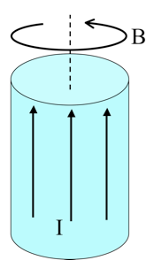

<section data-markdown>

A solid cylinder has uniform magnetization $\mathbf{M}$ throughout the volume in the $\phi$ direction as shown. In which direction does the bound surface current flow on the (curved) sides?

1. There is no bound surface current.
2. The current flows in the $\pm \phi$ direction.
3. The current flows in the $\pm s$ direction.
4. The current flows in the $\pm z$ direction.
5. The direction is more complicated.

</section>

<section data-markdown>

A very long aluminum (paramagnetic!) rod carries a uniformly distributed current $I$ along the $+z$ direction.
What is the direction of the bound volume current?

1. $\mathbf{J}_B$ points parallel to $I$
2. $\mathbf{J}_B$ points anti-parallel to $I$
3. It’s zero!
4. Other/not sure

Note:
* CORRECT ANSWER: A

</section>

<section data-markdown>

A very long aluminum (paramagnetic!) rod carries a uniformly distributed current $I$ along the $+z$ direction. We know $\mathbf{B}$ will be CCW as viewed from above. (Right?) What about $\mathbf{H}$ and $\mathbf{M}$ inside the cylinder?

1. Both are CCW
2. Both are CW
3. $\mathbf{H}$ is CCW, but $\mathbf{M}$ is CW
4. $\mathbf{H}$ is CW, $\mathbf{M}$ is CCW
5. ???

Note:
* CORRECT ANSWER: A
</section>

<section data-markdown>

A very long aluminum (paramagnetic!) rod carries a uniformly distributed current $I$ along the $+z$ direction. What is the direction of the bound volume current?

1. $\mathbf{J}_B$ points parallel to $I$
2. $\mathbf{J}_B$ points anti-parallel to $I$
3. It’s zero!
4. Other/not sure

Note:
* CORRECT ANSWER: A

</section>

<section data-markdown>

A very long aluminum (paramagnetic!) rod carries a uniformly distributed current $I$ along the $+z$ direction. What is the direction of the bound surface current?

1. $\mathbf{K}_B$ points parallel to $I$
2. $\mathbf{K}_B$ points anti-parallel to $I$
3. Other/not sure

Note:
* CORRECT ANSWER: B
</section>

<section data-markdown>

For linearly magnetizable materials, the relationship between the magnetization and the H-field is,

$\mathbf{M} = \chi_m \mathbf{H}$

What do you expect the sign of $X_m$ to be for a paramagnetic/diamagnetic material?

1. para: $\chi_m<0 \;$ dia: $\chi_m>0$
2. para: $\chi_m>0 \;$ dia: $\chi_m<0$
3. Both positive
4. Both negative

Note:
Correct answer: B

</section>
