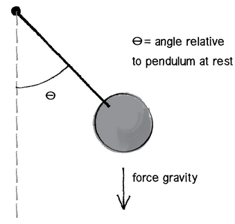
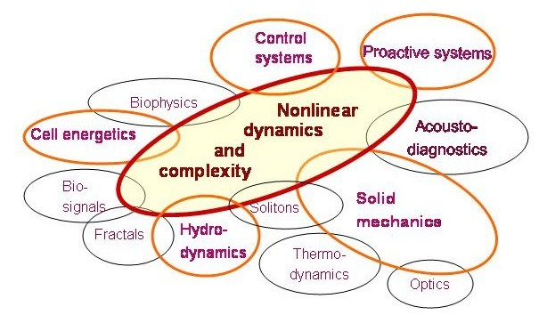

<section data-markdown>

Consider a pendulum of length $L$ with a mass $m$. What is the kinetic and potential energy associated with this system in terms of general coordinates?

1. $K = \frac{1}{2} m v^2 \; U=-mgh$
2. $K = \frac{1}{2} m L^2 \dot{\theta}^2 \; U=-mgh$
3. $K = \frac{1}{2} m v^2 \; U=-mgL\cos\theta$
4. $K = \frac{1}{2} m L^2 \dot{\theta}^2 \; U=-mgL\cos\theta$
5. Wait? I thought this was E&M?!

Note:
* Correct Answer: D

</section>

<section data-markdown>

The equation of motion for the pendulum is:

$$\ddot{\theta} = - \dfrac{g}{L} \sin \theta$$

How do we solve it?

1. I see the analytical solution!
2. Try Wolfram!
3. Numerically!
4. Include a request for solution in my annual letter to Santa

</section>

<section data-markdown>

## Nonlinear Dynamics

</section>

<section data-markdown>

Let's stick with one-dimensional problems, $\dot{x} = f(x)$. How do we solve this differential equation?

$$\dot{x} = \sin x$$

1. I see the analytical solution!
2. Try Wolfram!
3. Numerically!
4. Something else

</section>

<section data-markdown>

The analytical solution to $\dot{x} = \sin x$ for a particular $x_0$ at t=0 is given by,

$$t = ln\lvert\dfrac{\csc x_0 + \cot x_0}{\csc x + \cot x}\rvert$$

What happens to the solution when $x_0 = \pi/4$ as $t \rightarrow \infty$?

1. They grow without bound
2. They damp out to zero
3. They approach some non-zero constant
4. I have no clue, man

</section>

<section data-markdown>

In the phase portrait that we have drawn ($x-\dot{x}$ space), what do positive values of $\dot{x}$ correspond to in terms of "motion along the line"?

1. Leftward motion
2. Rightward motion
3. Leftward motion, but I'm not sure why
4. Rightward motion, but I'm not sure why
5. I'm not really sure

</section>

<section data-markdown>

Draw the phase portrait for $\dot{x} = 4 + x^2$.

* Determine the fixed points.
* Are they stable or unstable?
* How do you know?

</section>

<section data-markdown>

Consider the "normal form" of this one-dimensional problem,

$$\dot{x} = r + x^2$$

Let $r<0$, what does the graph of the phase potrait ($\dot{x}-x$ space) look like now?

</section>

<section data-markdown>

Consider the "normal form" of this one-dimensional problem,

$$\dot{x} = r + x^2$$

Let $r=0$, what does the graph of the phase potrait ($\dot{x}-x$ space) look like now?

</section>

<section data-markdown>

Consider the normal form, $\dot{x} = r - x^2$.

With your neighbors, construct the bifurcation diagram for this "saddle-node bifurcation."

</section>

<section data-markdown>

Consider the normal form of the "transcritical bifurcation",

$$\dot{x} = rx - x^2$$

Where are the fixed points?

1. $x = +\sqrt{r}\,\mathrm{and}\,-\sqrt{r}$
2. $x = 0\,\mathrm{and}\,-\sqrt{r}$
3. $x = +\sqrt{r}\,\mathrm{and}\,0$
4. $x = 0\,\mathrm{and}\,r$
5. $x = 0\,\mathrm{and}\,-r$

</section>
