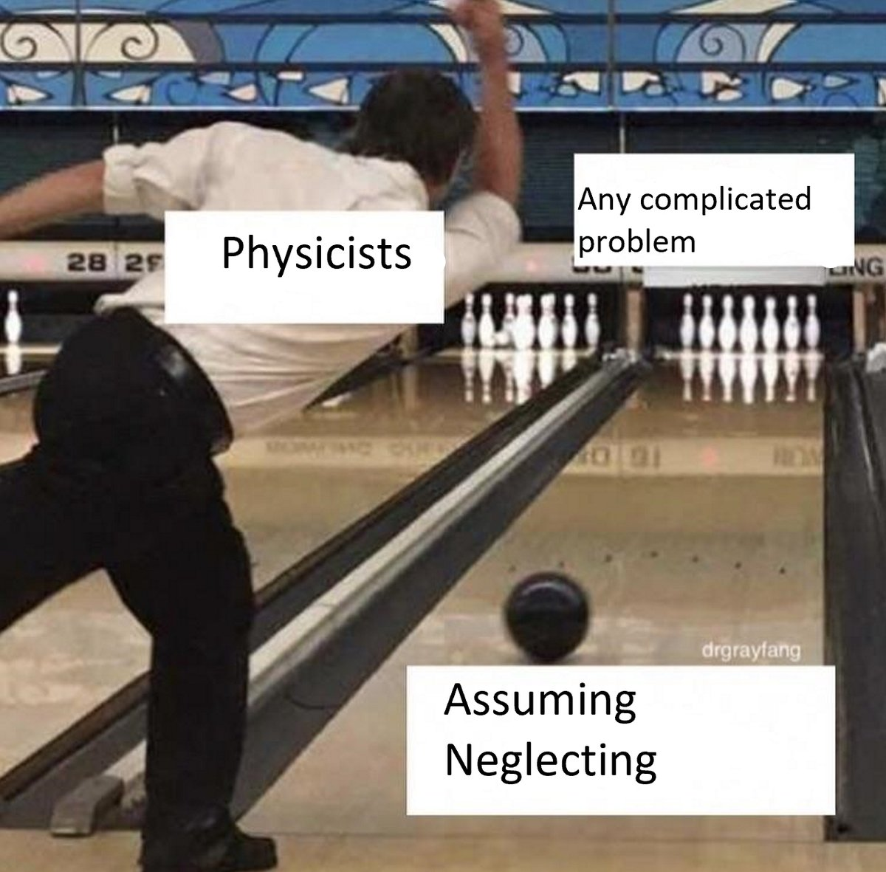
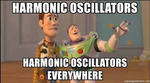
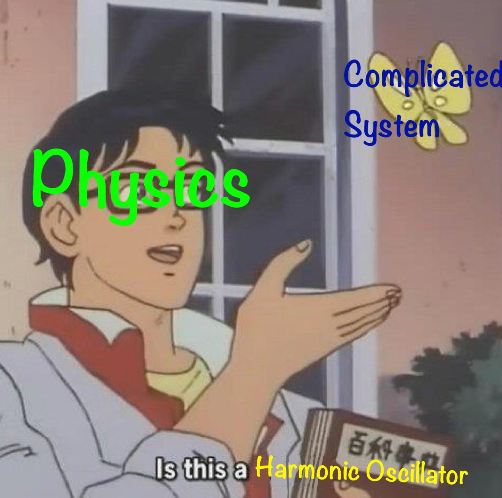
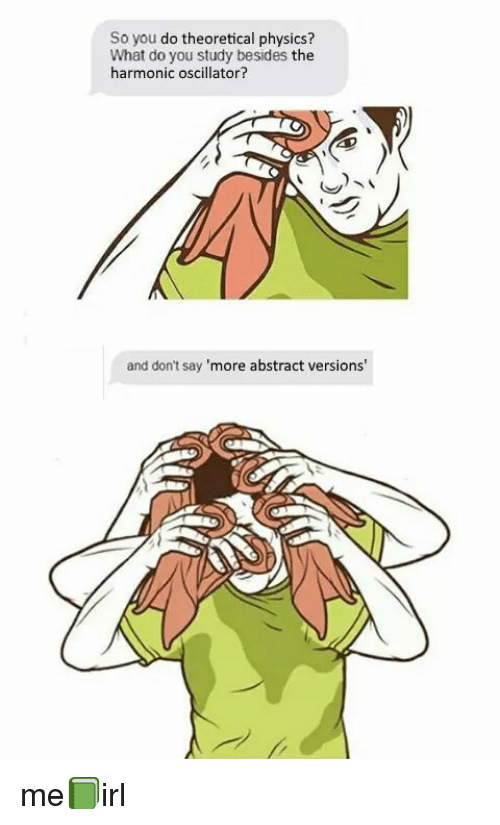

<section data-markdown>

Consider a pendulum with a bob of mass $m$ attached to a rigid but massless rod with length $L$. Which equation describes the motion of the bob with respect to the vertical?

1. $m\ddot{\theta} = +g\sin\theta$
2. $m\ddot{\theta} = -g\sin\theta$
3. $mL\ddot{\theta} = -mg\sin\theta$
4. $mL\ddot{\theta} = +mg\sin\theta$
5. Something else

Note: Correct answer: C

</section>

<section data-markdown>

Let's take the easy route for the moment.

$\ddot{\theta} \approx -\dfrac{g}{L} \theta$

</section>

<section data-markdown>

What is the general solution to: $\ddot{\theta} \approx -\omega^2 \theta$?

1. $\theta(t) = A \cos \omega t$
2. $\theta(t) = B \sin \omega t$
3. $\theta(t) = A \cos \omega t +  B \sin \omega t$
4. $\theta(t) = A \cos (\omega t + \delta)$
5. More than one of these

</section>

<section data-markdown>

OMGBBQPIZZA

</section>

<section data-markdown>

Nature tends to minimize energy

</section>

<section data-markdown>

Have you worked with phase space before?

1. Yes, and I recall how that works
2. Yes, I think so...ok, actually, maybe...
3. I have no idea what you are talking about, hoss

</section>

<section data-markdown>

Now that we have sketched $\langle \dot{x}, \dot{v} \rangle = \langle v,0\rangle$...

Sketch $\langle \dot{x}, \dot{v} \rangle = \langle 0,-x\rangle$ in phase space.

</section>

<section data-markdown>

What about $\ddot{x} = -\sin{x}$?

</section>
